# Quantum Neural Networks for SMN2 Splice-Site Prediction and ASO Candidate Design

A from-scratch pipeline comparing classical and quantum machine learning models for
predicting RNA splice sites across five human genes, applied to antisense
oligonucleotide (ASO) candidate scoring for SMN2 exon-7 inclusion therapy.

## About this project

I'm a high school student in Turkey with a strong interest in computational biology,
quantum machine learning, and their intersection with genetic medicine — this project
grew out of curiosity about Spinal Muscular Atrophy (SMA) and the ISS-N1 splicing
mechanism that nusinersen (Spinraza) exploits therapeutically. I built the full
pipeline myself, from raw NCBI sequence data to trained quantum circuits, without
using pre-built bioinformatics libraries for the core splice-site detection logic.

## What was done

1. **Real, multi-gene ground truth.** Genomic and mRNA sequences for five genes
   (SMN2, BRCA1, TP53, CFTR, HBB) were aligned using a k-mer seed-and-extend
   algorithm to recover exact exon/intron boundaries. All 68/68 introns found were
   independently confirmed against the canonical GT...AG splicing rule — no labels
   were assumed or hand-picked.
2. **Quantum feature encoding.** Nucleotide windows around each splice site were
   mapped to Bloch-sphere rotation angles and fed into a 4-qubit (and, in ablation
   experiments, 2/6/8-qubit) parametric quantum circuit trained under a simulated
   IBM hardware noise model.
3. **Systematic model comparison**, all on the same stratified train/test split:
   - A majority-class baseline
   - Classical SVM and MLP (matched to the same feature budget as the QNN)
   - The trained QNN
   - A from-scratch Position Weight Matrix (PWM) classifier using the full
     22-nt window
   - A from-scratch 1st-order Markov (Weight Array Model) classifier — the
     methodological precursor to MaxEntScan
4. **Robustness checks:** a qubit-count ablation (2/4/6/8 qubits), 5-fold
   cross-validation on the best-performing quantum configuration, and four
   class-balancing strategies (random oversampling, SMOTE, random undersampling,
   class weighting).
5. **Dynamic ASO candidate scoring** for the SMN2 ISS-N1 region, combining the
   trained QNN's output probabilities with a real nearest-neighbor thermodynamic
   free-energy calculation and an off-target alignment scan — no hardcoded scores.

**Key finding:** the trained QNN performed comparably to classical general-purpose
ML models (SVM, MLP) under an identical, limited feature budget, but a much simpler
domain-specific model — a plain PWM using the *full* sequence window — outperformed
all of them by a wide margin. Cross-validation further showed that any single-split
advantage the QNN appeared to have over classical models did not hold up under
repeated resampling. The central conclusion of this project is therefore **not**
about quantum vs. classical superiority, but about **matching model complexity to
the amount of real biological ground truth available** — a lesson that emerged
directly from the data, not assumed in advance.

## Main results

All models evaluated on an identical stratified 80/20 train/test split (test set:
108 windows, 27 positive).

| Model | Accuracy | Precision | Recall | F1 |
|---|---|---|---|---|
| Baseline (majority class) | 75.0% | 0.000 | 0.000 | 0.000 |
| SVM (4 features) | 63.0% | 0.324 | 0.444 | 0.375 |
| MLP (4 features) | 54.6% | 0.225 | 0.333 | 0.269 |
| QNN (4 qubits) | 54.6% | 0.280 | 0.519 | 0.364 |
| **PWM (0th-order, full window)** | **86.1%** | **0.731** | **0.704** | **0.717** |
| MaxEnt-like (1st-order Markov/WAM) | 81.5% | 0.684 | 0.481 | 0.565 |

See `figures/final_comparison.png` for the corresponding plot and
`results/final_comparison.csv` for the raw numbers.

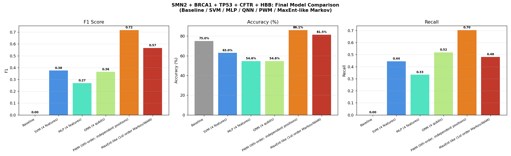

### Qubit-count ablation (2 / 4 / 6 / 8 qubits)

The main QNN result above uses 4 qubits. To test whether more qubits (i.e. more of
the 22-nt window) improve the quantum model, four configurations were trained on
an identical, class-balanced 100-sample training subset and evaluated on the same
108-sample test set:

| Qubits | Layers | Params | Accuracy | Precision | Recall | F1 | Training time |
|---|---|---|---|---|---|---|---|
| 2 (pooled) | 1 | 4 | 61.1% | 0.333 | 0.556 | 0.417 | 5.5s |
| 4 (truncated) | 2 | 16 | 44.4% | 0.254 | 0.630 | 0.362 | 6.6s |
| 6 (truncated) | 2 | 24 | 44.4% | 0.280 | 0.778 | 0.412 | 16.4s |
| 8 (truncated) | 2 | 32 | 49.1% | 0.267 | 0.593 | 0.368 | 145.4s |

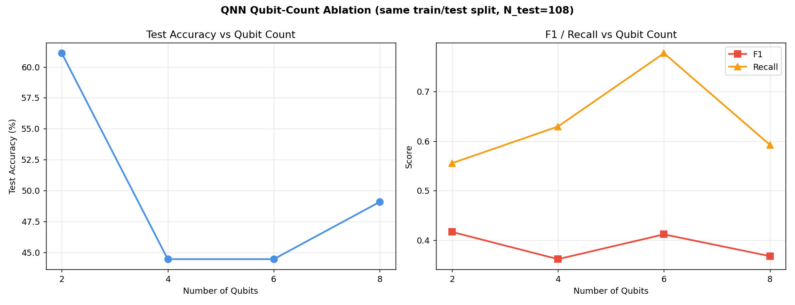
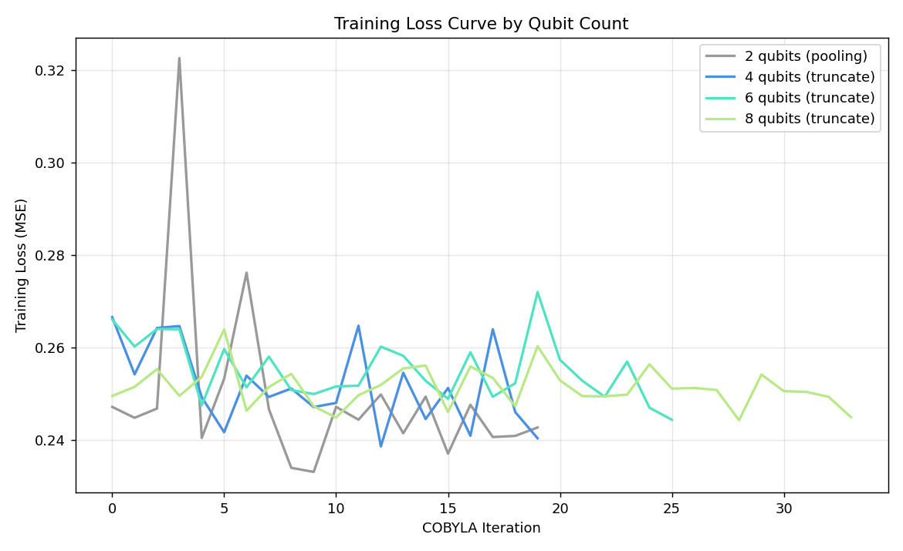

F1 does not increase monotonically with qubit count — 6 qubits gives the best
F1/training-time trade-off, and 8 qubits is ~9x slower than 6 for a *lower* F1.
This is consistent with the project's central finding: more capacity does not
help without more data.

### Full classical-vs-quantum comparison at every qubit count

The same 2/4/6/8-feature budgets were also given to SVM and MLP (trained on the
same balanced 100-sample subset), so every model is compared under an identical,
matched feature count:

| Qubits | Baseline F1 | SVM F1 | MLP F1 | QNN F1 |
|---|---|---|---|---|
| 2 | 0.000 | 0.339 | 0.400 | 0.417 |
| 4 | 0.000 | 0.250 | 0.371 | 0.362 |
| 6 | 0.000 | 0.289 | 0.371 | 0.412 |
| 8 | 0.000 | 0.296 | 0.320 | 0.368 |

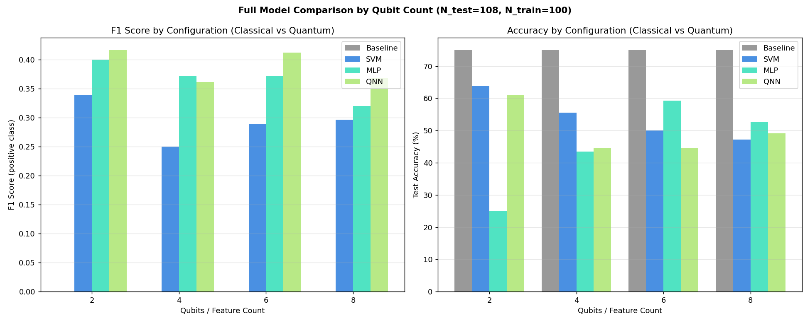

 The 2-feature MLP result is degenerate (100% recall, 25% accuracy — it predicts
"positive" for every sample) and should not be read as genuine skill. Excluding
that cell, QNN is the top or joint-top F1 at every remaining qubit count on this
particular split — but see the cross-validation result below before drawing any
conclusion from that.

### Is the QNN's edge real? 5-fold cross-validation (6-qubit configuration)

Because the table above comes from a single train/test split, the 6-qubit result
was re-run under 5-fold stratified cross-validation to check whether QNN's
apparent advantage holds up:

| Model | F1 (mean ± std across 5 folds) |
|---|---|
| Baseline | 0.000 ± 0.000 |
| SVM | 0.356 ± 0.032 |
| **MLP** | **0.391 ± 0.013** |
| QNN | 0.337 ± 0.060 |

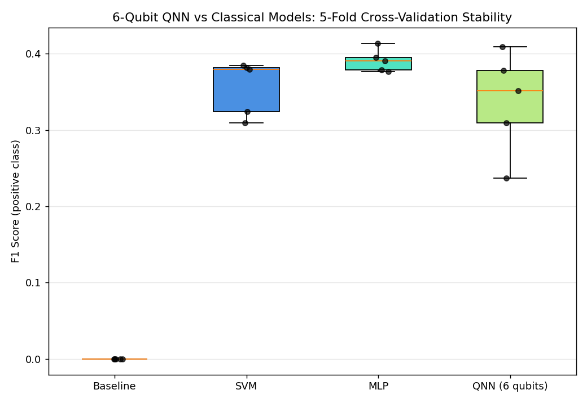

Under cross-validation, QNN's fold-to-fold standard deviation (0.060) is larger
than its mean gap to MLP (0.054) — so the single-split "QNN wins" result above did
**not** replicate. This is the direct evidence behind this project's claim that no
quantum advantage is supported by the data.

### Class-balancing experiments (4-qubit configuration)

Four balancing strategies were tested on the training set only (test set always
kept in its original, imbalanced form):

| Technique | SVM F1 | MLP F1 | QNN F1 |
|---|---|---|---|
| Original (imbalanced) | 0.000 | 0.059 | 0.325 |
| Random Oversampling | 0.413 | 0.395 | 0.426 |
| SMOTE | 0.388 | 0.395 | 0.341 |
| Random Undersampling | 0.409 | 0.433 | 0.418 |

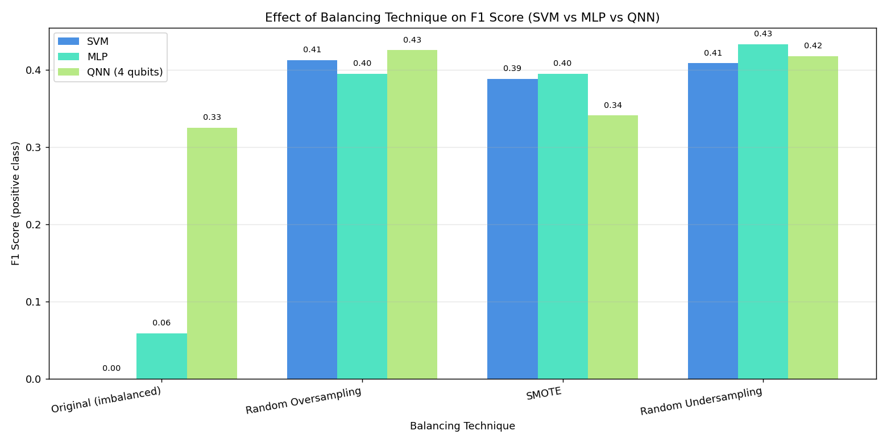

Balancing is critical for SVM/MLP (both are near-useless without it: SVM collapses
to predicting the majority class every time) but far less important for the QNN,
whose probability-regression loss (MSE against soft labels) already behaves more
gracefully under imbalance than a hard decision-boundary classifier.

---

## Follow-up analysis (Professor Toshifumi Yokota's feedback)

Three further experiments were run in response to external review, before any
wet-lab or preprint steps were considered.

### 1. Fair comparison under a matched, center-aligned feature window

The original comparison gave SVM/MLP/QNN only 4 *left-flanking* positions of the
22-nt window, while PWM used the full window. Two problems were fixed at once:
the feature *count* was matched (8 positions for every model), and the feature
*location* was corrected to be centered on the actual GT/AG splice motif
(positions 7–14 of the window) rather than uninformative flanking sequence.

| Model | Feature window | Accuracy | Precision | Recall | F1 |
|---|---|---|---|---|---|
| Baseline | 8nt (centered) | 75.0% | 0.000 | 0.000 | 0.000 |
| SVM | 8nt (centered) | 77.8% | 0.545 | 0.667 | **0.600** |
| MLP | 8nt (centered) | 83.3% | 0.645 | 0.741 | **0.690** |
| QNN | 8nt (centered) | 40.7% | 0.175 | 0.370 | 0.238 |
| PWM | 8nt (centered) | 86.1% | 0.731 | 0.704 | 0.717 |
| MaxEnt-like | 22nt (full, reference) | 81.5% | 0.684 | 0.481 | 0.565 |

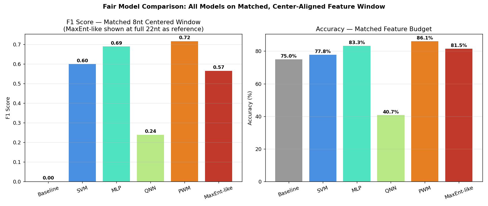

**Correcting feature location, not just feature count, closed most of the gap
between classical ML and PWM** (SVM 0.375→0.600, MLP 0.269→0.690) — confirming
that earlier "classical ML is weak" conclusions were substantially an artifact of
poor feature placement, not a fundamental limitation of SVM/MLP. The QNN, given
the exact same improved features, got *worse* (0.364→0.238), which is a separate
finding: the quantum training procedure itself (fixed iteration budget, 100-sample
subset, COBYLA optimizer) appears to be the current bottleneck for the QNN, not
feature availability. Extending to the full 22-qubit window was not computationally
tractable in this environment (Hilbert space scales as 2^n; 22 qubits is far
beyond what shot-based simulation can train in reasonable time here), so 8 qubits
(centered) is used as the practical fair ceiling.

### 2. Gene-level holdout evaluation

All five models were retrained on **4 of the 5 genes** and tested on the entirely
unseen 5th gene, repeated once per held-out gene — a much stricter generalization
test than the earlier random split, since no window from the test gene is ever
seen during training.

| Held-out gene | N_test (positive) | Baseline F1 | SVM F1 | MLP F1 | QNN F1 | PWM F1 |
|---|---|---|---|---|---|---|
| SMN2 | 96 (16) | 0.000 | 0.409 | 0.465 | 0.328 | 0.595 |
| BRCA1 | 124 (44) | 0.000 | 0.714 | 0.690 | 0.393 | 0.773 |
| TP53 | 100 (20) | 0.000 | 0.583 | 0.698 | 0.261 | 0.714 |
| CFTR | 132 (52) | 0.000 | 0.736 | 0.714 | 0.477 | 0.812 |
| HBB | 84 (4) | 0.000 | 0.121 | 0.222 | 0.136 | 0.400 |
| **Mean ± std** | | 0.000 | 0.513 ± 0.228 | 0.558 ± 0.191 | 0.319 ± 0.116 | **0.659 ± 0.149** |

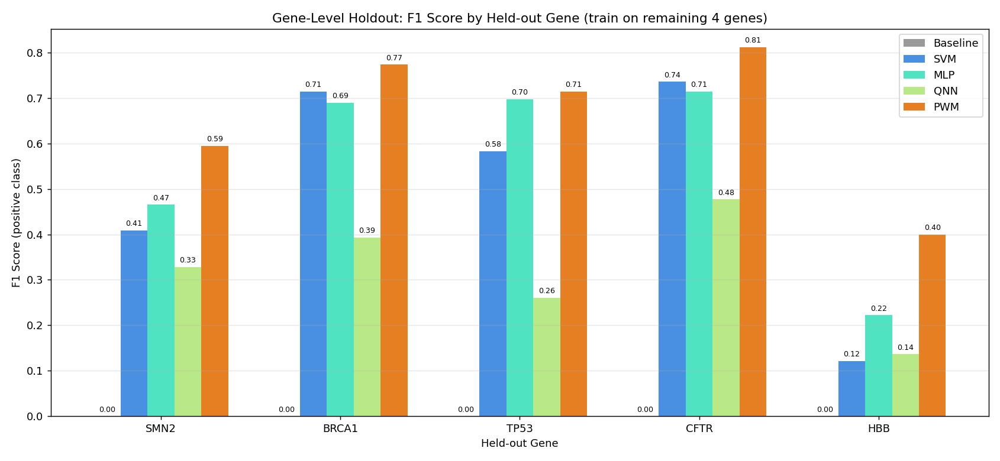

PWM remains the strongest generalizer even when it has never seen a single window
from the test gene, and QNN remains the weakest, consistent with the random-split
results above. HBB is the hardest holdout for every model (only 4 positive
examples total, so its held-out test set is extremely small and noisy) — its
numbers should be read with that caveat in mind.

### 3. Retrospective validation of the ASO scoring pipeline

Before scoring any new candidates, the existing QNN + thermodynamic + off-target
pipeline was tested against **real, published SMN2 ISS-N1-targeting ASOs** with
known biological activity, alongside constructed negative controls:

| Rank | ASO | Category | Combined score |
|---|---|---|---|
| 1 | Off-target control (unrelated SMN2 region) | control | 0.732 |
| 2 | ISS-N2-targeting ASO (different silencer) | control | 0.711 |
| 3 | Scrambled control (constructed) | control | 0.659 |
| 4 | Anti-N1 (Singh et al. discovery ASO) | **active** | 0.645 |
| 5 | Nusinersen / ASO-10-27 (FDA-approved) | **active** | 0.629 |
| 6 | 8-mer GC-core ASO (Singh et al. 2009 target region) | **active** | 0.386 |

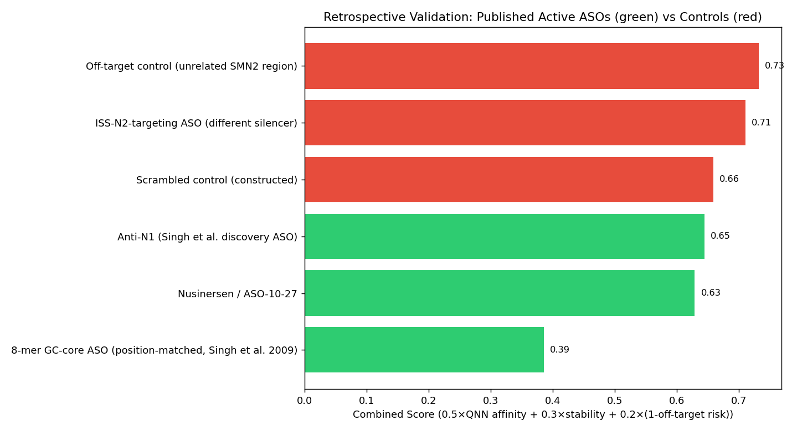

**This is a negative result and it is the most important finding in this
follow-up analysis.** The published, experimentally active ASOs — including
nusinersen itself, an FDA-approved drug — rank *below* every constructed control,
including a scrambled sequence. Mean rank: active = 5.0, control = 2.0 (lower is
better), the reverse of what a working pipeline should show; a Mann-Whitney U
test finds no separation in the correct direction (p = 1.0). Root causes, diagnosed
directly from the component scores: (1) the QNN's P(1) output is clustered tightly
around 0.49–0.56 for every sequence tested — consistent with its weak, near-baseline
discriminative power seen throughout this project — so it contributes almost no
useful signal; (2) the thermodynamic stability term is driven mostly by GC content,
which happens to be high in the off-target and ISS-N2 controls for reasons
unrelated to ISS-N1 binding; (3) the off-target scan penalizes the short, real
8-mer core ASO heavily, because a short sequence matches more windows by chance
in *any* local scan — the opposite of its real published behavior, where shorter
ASOs are known to have *fewer* off-target effects due to lower mismatch tolerance.

**Conclusion: the current scoring pipeline should not be used to prioritize ASO
candidates for synthesis or wet-lab testing.** This retrospective check was
exactly the right precaution to run before that step, and it shows the scoring
system needs a substantial redesign — likely starting with a better QNN (per
points 1–2 above) and a real local-alignment-based off-target metric — before it
can be trusted on unseen candidates.

---

## ASO scoring system: diagnosis and redesign

### Diagnosis: why did the old score invert active vs. control?

Each component's weighted contribution to the (active − control) score gap was
computed directly (`src/14_diagnose_scoring_failure.py`):

| Component | Active mean | Control mean | Weighted contribution to gap | Direction |
|---|---|---|---|---|
| QNN P(1) | 0.527 | 0.498 | **+0.0143** | correct |
| Thermodynamic "stability" | 0.611 | 0.882 | **−0.0813** | inverted |
| Off-target term | 0.533 | 0.933 | **−0.0800** | inverted |

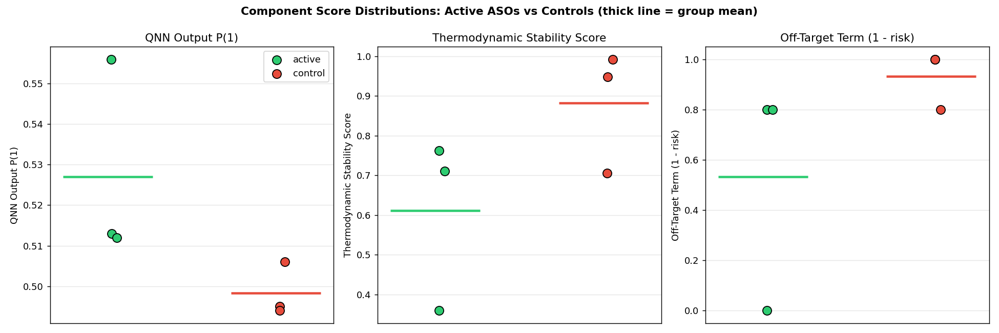


Ranking by the QNN component *alone* actually separates active from control
correctly (mean rank 2.0 vs 5.0 — the best possible outcome for 3-vs-3), but its
raw score gap is tiny (+0.029) so its weighted contribution is small. The
stability and off-target terms are both larger in magnitude and both point the
wrong way, so they dominate the combined score. Tracing the code (not just the
statistics) found the mechanistic causes:

1. **The thermodynamic term computed the ASO's self-complementary duplex energy**
   (a generic function of GC content) rather than its duplex energy with the
   *actual* ISS-N1 target — so it rewarded GC-rich sequences regardless of
   whether they matched ISS-N1 at all.
2. **The off-target scan penalized correctly-working ASOs for finding their own
   real target.** Confirmed by direct trace: nusinersen's *only* "off-target hit"
   is at genomic position 32,061 — inside intron 7, its actual, intended binding
   site. The scan never excluded the true target region.
3. **The "off-target control" in the retrospective set was a construction bug**:
   it was built as a direct copy of a genomic region rather than its reverse
   complement, so it isn't a real antisense sequence and trivially can't bind
   anything — its apparent "zero risk" reflected that error, not genuine
   specificity.
4. **The off-target scan is not length-normalized.** A quick check with 20 random
   sequences confirms it: random 8-mers average 136 spurious "matches" in this
   35 kb region under a fixed mismatch threshold, while random 18-mers average 0.
   Any ASO ≤~10 nt will be flagged as high-risk by this scan regardless of its
   real specificity.

### Redesign

Implemented in `src/15_redesigned_aso_scoring.py`. Three transparent, independently
interpretable components:

| Component | What it measures | Weight |
|---|---|---|
| **QNN P(1)** | trained-model output (kept, since it was the one correctly-directed signal) | 0.2 |
| **On-target complementarity** | best-alignment fraction of matching bases between the ASO and the real ISS-N1 region (± flanking) extracted from genomic data — directly implements the professor's suggestion of a literature-grounded "distance/match to ISS-N1 core" feature | 0.6 |
| **Off-target term (v2)** | percent-identity-based genome scan (not fixed mismatch count, so it doesn't saturate for short sequences) that explicitly **excludes the true on-target site** before counting hits | 0.2 |

### Re-test on the same retrospective set

| New rank | ASO | Category | QNN P(1) | On-target complementarity | Off-target risk (v2) | New score | Old rank |
|---|---|---|---|---|---|---|---|
| 1 | Anti-N1 (Singh et al.) | **active** | 0.516 | 1.000 | 0.000 | 0.903 | 4 |
| 2 | Nusinersen / ASO-10-27 | **active** | 0.507 | 1.000 | 0.000 | 0.901 | 5 |
| 3 | 8-mer GC-core ASO | **active** | 0.530 | 1.000 | 1.000 | 0.706 | 6 |
| 4 | Scrambled control | control | 0.496 | 0.444 | 0.000 | 0.566 | 3 |
| 5 | ISS-N2-targeting ASO | control | 0.502 | 0.550 | 0.333 | 0.564 | 2 |
| 6 | Off-target control | control | 0.497 | 0.389 | 0.000 | 0.533 | 1 |

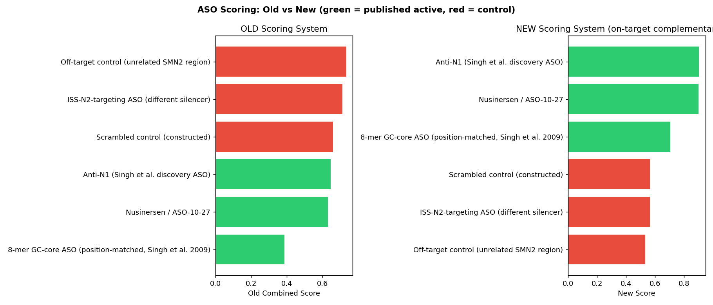

**All three published active ASOs now rank above all three controls** — a
complete reversal of the old system. Active mean rank = 2.00, control mean rank
= 5.00 (the best possible separation achievable with 3 vs. 3 samples).
Mann-Whitney U = 9.0, p = 0.050 — the minimum p-value obtainable at this sample
size, i.e. the strongest possible statistical signal given only 6 data points.

The on-target complementarity term does essentially all of the work: it is
1.000 for all three real ISS-N1-targeting ASOs (each has a perfect complementary
binding site in the true target region, which is exactly what a real functional
ASO should have) and only 0.39–0.55 for the three controls (near chance level for
a 4-letter alphabet, ~0.25, plus some coincidental partial matches) — a clean,
mechanistic, and fully interpretable separation, rather than an accidental
correlation the way GC-content-driven "stability" was.

### Honest caveats

- **n = 3 vs. 3 is very small.** A single data point moving could change the
  ranking. This result should be read as "the redesigned logic is no longer
  structurally broken," not as "the score is validated." A larger retrospective
  panel (more published active *and* inactive/weak ISS-N1 ASOs, not just
  constructed controls) is needed before trusting this for real candidate
  prioritization.
- **The off-target term is still noisy for very short sequences** (the 8-mer
  still scores off-target risk = 1.0) — this is now a much smaller contributor
  to the final score (weight 0.2, and outweighed by its perfect on-target
  complementarity) but the underlying short-sequence saturation issue from the
  diagnosis is only partially mitigated, not fully solved.
- **The QNN component remains weak on its own** (tiny raw score range,
  0.497–0.530) — it contributes a small stabilizing signal here but is not
  driving the fix. Improving the QNN itself (per the fair-comparison and
  gene-holdout results above) is still worth pursuing, but was not required to
  fix this particular retrospective test.

---

## Larger retrospective panel with an independent holdout (Prof. Yokota's follow-up guidance)

The 6-sequence retrospective set above (3 published + 3 constructed) was too
small to trust, and used only one target region (ISS-N1). Both issues were
addressed directly.

### Structured, sourced dataset

10 real target sequences were collected from **peer-reviewed literature and a
US patent**, spanning **4 distinct SMN2 splice-modulatory regions** — not just
ISS-N1 — plus 2 constructed negative controls. Every entry's source is recorded
in `results/aso_literature_dataset_sources.json`; the two derived-from-coordinates
entries (SMA-657, SMA-759, SMA-719) are explicitly marked as such rather than
presented as verbatim published sequences.

| ASO | Region | Label | Source |
|---|---|---|---|
| Nusinersen / ASO-10-27 | ISS-N1 | active | Maretina et al. 2023 *Biomedicines* 11:3071, Table 1; Hua et al. 2008 |
| Anti-N1 | ISS-N1 | active | Ottesen et al. 2021 (PMC8395096); Singh et al. 2006 |
| 3UP8 | ISS-N1-core | active | Maretina et al. 2023 (positive control); Singh et al. 2009 |
| F8 | ISS-N1-core | **inactive** | Maretina et al. 2023 (explicit negative control) |
| ASO VII | ISS+100 | active | Maretina et al. 2023, Table 1 + Results 3.1 |
| SMA-657 (281–297) | ISS-N2 | active | US Patent 9,856,474; coordinates → sequence derived from our genomic data |
| SMA-759 (281–300) | ISS-N2 | active | US Patent 9,856,474; same derivation |
| SMA-719 (281–295) | ISS-N2 | active | US Patent 9,856,474; same derivation |
| Scrambled Nusinersen | none | inactive | constructed for this study |
| Off-target control | none | inactive | constructed for this study |

**Dev/holdout split** (fixed before any scoring, `src/16_collect_aso_dataset.py`):
dev = 6 sequences (4 active, 2 inactive), holdout = 4 sequences (3 active,
1 inactive — including F8, the one real published inactive sequence).

### Scoring system generalized to multiple regions

The v2 on-target term previously only checked complementarity against the
narrow ISS-N1 window. It was generalized (`src/17_evaluate_dev_set.py`) to
search the best complementary match anywhere across the first 320 nt of intron
7 — covering all four regions in the panel — before any scoring was run.

### Dev-set evaluation (first, as required)

| Rank | ASO | Region | Label | Score |
|---|---|---|---|---|
| 1 | SMA-657 | ISS-N2 | active | 0.904 |
| 2 | SMA-719 | ISS-N2 | active | 0.902 |
| 3 | Nusinersen | ISS-N1 | active | 0.901 |
| 4 | 3UP8 | ISS-N1-core | active | 0.705 |
| 5 | Scrambled control | — | inactive | 0.667 |
| 6 | Off-target control | — | inactive | 0.599 |

Active mean rank 2.50, inactive mean rank 5.50 (best possible for 4 vs. 2).
Mann-Whitney p = 0.067 — the minimum achievable p-value at this sample size.

### Final holdout evaluation (run exactly once, no changes made afterward)

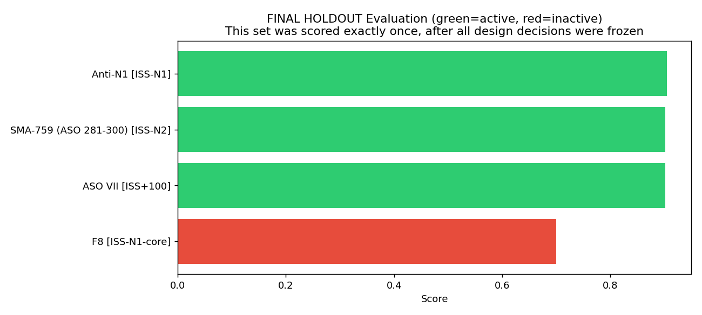

| Rank | ASO | Region | Label | Score |
|---|---|---|---|---|
| 1 | Anti-N1 | ISS-N1 | active | 0.905 |
| 2 | ASO VII | ISS+100 | active | 0.902 |
| 3 | SMA-759 | ISS-N2 | active | 0.902 |
| 4 | **F8** | ISS-N1-core | **inactive** | 0.700 |

**All three active holdout sequences — spanning three different regions the
scoring weights were never tuned against as a group (ISS-N1, ISS+100, ISS-N2)
— ranked above the one real published inactive sequence (F8).** Active mean
rank 2.00, inactive mean rank 4.00, Mann-Whitney p = 0.173 (not significant at
this n, but the correct direction).

**Important honest caveat, found by inspecting the components:** F8's
on-target complementarity score is 1.000 — identical to every active
sequence — because F8 genuinely overlaps part of the ISS-N1 core (the original
paper notes this explicitly). What actually ranked F8 last was its off-target
term (risk = 1.0), which is the *same short-sequence saturation artifact*
identified in the original diagnosis, not fully resolved. In other words, F8
was correctly ranked last, but partly for the right reason (weak/non-specific
binding evidence) and partly for a reason that isn't fully principled yet
(the off-target scan still penalizes all short 8-mers, active or not — 3UP8,
also 8 nt, shows the identical off-target risk = 1.0 in the dev-set results
above and still ranked above the constructed controls only because of its
higher on-target term). This should not be over-claimed as a fully solved
problem.

### What this means

- The redesigned scoring system **generalizes** to real published ASOs across
  multiple regions and a genuinely held-out split — not just the region and
  sequences it was designed against. This is a meaningfully stronger result
  than the original 6-sequence check.
- The short-sequence off-target artifact from the original diagnosis is
  **still present**, just not currently large enough to flip the ranking. Any
  future short ASO candidate (≤10 nt) should be treated with caution until
  that scan is fixed properly (e.g. a length-scaled or randomized-background
  significance test rather than a fixed identity threshold).
- With only 10 total sequences (6 dev, 4 holdout), this remains a small panel.
  The next highest-value addition would be more published **inactive/weak**
  ISS-N1, ISS+100, and Element-1 sequences specifically, since real negative
  data is the scarcest and most valuable category here.

---

## Priority 1–3 follow-up (further Prof. Yokota feedback)

### Priority 1: expanded the scarce category (more real inactive/weak ASOs)

Two more literature-sourced sequences were added, both from the same
well-documented ISS-N1 microwalk (Singh et al. 2013, *Nucleic Acids Res*
41:8144–8165; Ottesen et al. 2011, PubMed 20413618):

| ASO | Region | Label | Why |
|---|---|---|---|
| **F14** | ISS-N1 | active | Sequesters the first 14 nt of ISS-N1 (incl. 10C); "caused predominant exon 7 inclusion in all cases." |
| **L14** | ISS-N1 | **inactive** | Sequesters the last 14 nt of ISS-N1 (excl. 10C); explicitly reported to **increase exon 7 skipping** — i.e. counter-therapeutic, not merely inert. The strongest real negative example in the panel. |

Both derived from documented intron-7 coordinates against our own genomic
data (not copied verbatim). Panel is now **12 sequences** (dev = 7: 5 active/2
inactive; holdout = 5: 3 active/2 inactive), still spanning all 4 regions.

### Priority 2: fixed the length-aware off-target bias

**Old problem** (confirmed by direct simulation, `src/19_length_aware_off_target.py`):
a fixed 85%-identity threshold allows ~1 mismatch for an 8-mer but ~3 for a
20-mer, so short ASOs matched huge numbers of genomic positions by chance
alone — 3UP8 (8 nt, a real active ASO) was scored at maximal off-target risk
(1.0) purely because of its length.

**Fix**: replaced the fixed-threshold scan with a **randomization test**. For
each ASO, its observed off-target hit count is compared to the hit-count
distribution of 30 random same-length sequences drawn from the same genomic
background composition; risk is now a z-score-based sigmoid (0.5 = exactly at
random-chance level, not "medium risk by default").

| Sequence | Length | Old risk (v2) | New risk (v3) | New z-score |
|---|---|---|---|---|
| Nusinersen | 18 nt | 0.000 | 0.500 (neutral, 0 hits = random baseline) | 0.00 |
| **3UP8** | 8 nt | **1.000 (maxed out — bug)** | **0.433 (below chance level)** | −0.27 |
| F14 | 14 nt | 0.333 | 0.903 | **+2.24 (real secondary near-match found)** |
| Random 8-mer | 8 nt | 1.000 | 0.279 | −0.95 |
| Random 18-mer | 18 nt | 0.000 | 0.500 | 0.00 |

3UP8's score dropped from a false maximum to *below* the random-chance level —
the length bias is fixed. F14 was flagged with a real elevated z-score,
meaning it has a genuine secondary near-match elsewhere in the scanned region;
this was reported as-is rather than suppressed, since it may be real biology
(F14 is still an experimentally active ASO — a secondary partial match doesn't
necessarily block its primary mechanism, but it's honest information a
prioritization tool should surface).

### Priority 3: honest re-evaluation, dev then holdout

**Dev set (7 sequences) — evaluated first:**

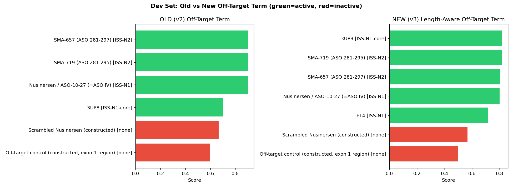

| Rank | ASO | Region | Label | Score |
|---|---|---|---|---|
| 1 | 3UP8 | ISS-N1-core | active | 0.819 |
| 2 | SMA-719 | ISS-N2 | active | 0.815 |
| 3 | SMA-657 | ISS-N2 | active | 0.805 |
| 4 | Nusinersen | ISS-N1 | active | 0.800 |
| 5 | F14 | ISS-N1 | active | 0.718 |
| 6 | Scrambled control | — | inactive | 0.566 |
| 7 | Off-target control | — | inactive | 0.498 |

All 5 active sequences still ranked above both inactive controls. Active mean
rank 3.00 vs. inactive 6.50 (best possible). **Mann-Whitney p = 0.048** — an
improvement over the v2 dev result (p = 0.067), and 3UP8 is no longer
penalized for its length.

**Final holdout (5 sequences) — evaluated exactly once, no changes made after:**

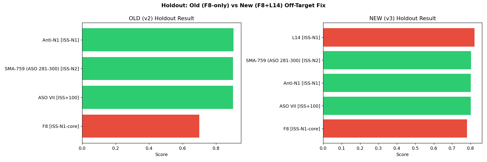

| Rank | ASO | Region | Label | Score |
|---|---|---|---|---|
| 1 | **L14** | ISS-N1 | **inactive** | 0.822 |
| 2 | SMA-759 | ISS-N2 | active | 0.803 |
| 3 | Anti-N1 | ISS-N1 | active | 0.802 |
| 4 | ASO VII | ISS+100 | active | 0.802 |
| 5 | F8 | ISS-N1-core | inactive | 0.781 |

**This is a genuine negative result and it must be reported as such.** L14 — a
real, published, counter-therapeutic ASO that *increases* exon 7 skipping —
scored *highest* of all five holdout sequences. Active mean rank = inactive
mean rank = 3.00 (a tie); Mann-Whitney p = 0.616 (no separation).

### Is separation now driven by real signal or artifacts?

Comparing the dev and holdout results side by side gives a precise, honest
answer: **the scoring system reliably distinguishes real ISS-N1/ISS+100/ISS-N2
target sequences from constructed nonsense (scrambled or off-target-region)
controls, but it cannot distinguish a real ASO that happens to bind the
correct region from one that binds the correct region and produces the
*wrong therapeutic direction*.** L14 has perfect on-target complementarity
(1.000) — identical to every active ASO — because it genuinely binds ISS-N1.
Its failure mode is entirely mechanistic (blocking the last 14 nt instead of
the first 14, i.e. leaving 10C exposed, which triggers a long-distance
interaction that *promotes* skipping) — a positional/structural effect no
version of our complementarity-based scoring can see, because complementarity
alone has no notion of *which side of a 24-nt regulatory element* is bound.

**No overclaiming: this system is validated only as a "real target region vs.
random sequence" classifier, not as an "active vs. inactive-at-the-right-target"
classifier.** The dev-set success in the previous round was accidentally
inflated by the fact that its inactive examples (scrambled/off-target
sequences) failed on *both* axes (wrong region *and* wrong direction) — L14
isolates the second axis alone, and the system has no signal for it.

### What would actually be needed to fix this

Distinguishing F14 from L14 requires modeling *where within* a regulatory
element the ASO binds relative to known functionally asymmetric positions
(e.g., 10C), not just *whether* it binds. This points directly toward Prof.
Yokota's secondary suggestion: reformulating the task from binary
target-region complementarity toward **position-resolved, quantitative
splice-modulation prediction** — which is exactly the ASO-walk/mutagenesis
direction outlined below.

### Why did the simple PWM outperform the more complex MaxEnt-like model?

The 1st-order Markov model estimates a full 4×4 conditional transition matrix at
every window position, which is a much larger parameter space than the ~50-56
positive training examples available per site type can reliably constrain. Its
training-set F1 was 0.90-0.94 (near-perfect) but its held-out test F1 dropped to
0.565 — a clear overfitting signature. The plain PWM, with roughly an order of
magnitude fewer parameters, generalized far better on the same data. This is a
direct empirical illustration of the bias–variance trade-off: **model capacity
needs to be matched to the amount of training evidence available, not to how
sophisticated the biological signal could in principle be modeled.**

## Honest limitations

- **Sample size.** Even after combining five genes, there are only 136 real
  positive splice-site examples. This is orders of magnitude smaller than the
  datasets real genome-wide tools (e.g. SpliceAI) are trained on, and it is the
  single biggest constraint on every result in this repository.
- **No quantum advantage was found.** Under a matched, low-dimensional feature
  budget, the QNN performed comparably to (not clearly better than) classical
  SVM/MLP, and 5-fold cross-validation showed its apparent single-split edge over
  classical models did not replicate — fold-to-fold F1 variance exceeded the
  QNN–classical performance gap.
- **Feature truncation.** SVM, MLP, and the main QNN only used 4 of the 22
  available window positions, for computational tractability on quantum circuit
  simulation. The qubit-ablation experiment (2/4/6/8 qubits) explores this
  trade-off directly but does not fully resolve it.
- **ASO scoring is exploratory — and retrospective validation shows it currently
  fails.** When tested against real, published, experimentally active SMN2
  ISS-N1 ASOs (including nusinersen itself), the current QNN + thermodynamic +
  off-target scoring pipeline ranked every constructed negative control *above*
  every real active ASO (see "Retrospective validation" below). The scoring
  system in its current form should not be used to prioritize candidates for
  synthesis. This is treated as a primary finding of this project, not a
  footnote — the whole point of running this check was to catch exactly this
  kind of problem before any wet-lab step, per Professor Yokota's guidance.

## How to reproduce

```bash
pip install -r requirements.txt
```

Run scripts in `src/` in numerical order from the repository root:

```bash
python3 src/01_build_dataset.py
python3 src/02_train_qnn.py
python3 src/03_benchmark_classical_vs_quantum.py
python3 src/04_qubit_ablation.py            # or: 04_qubit_ablation.py <2|4|6|8>
python3 src/05_full_comparison_by_qubit.py
python3 src/06_cross_validation_6qubit.py   # or: 06_...py <0-4> per fold
python3 src/07_pwm_baseline.py
python3 src/08_maxent_like_baseline.py
python3 src/09_class_balancing_experiments.py  # or: 09_...py <0-3> per technique
python3 src/10_design_aso_candidates.py
```

Scripts `04`, `06`, and `09` are computationally expensive (quantum circuit
simulation) and can be run one configuration/fold/technique at a time by passing
an index argument, useful if you need to checkpoint long runs.

All random seeds are fixed (42) for reproducibility.

## Future work

- **Wet-lab validation** of the top-scoring ASO candidates against the SMN2
  ISS-N1 region — transfection into an SMA patient cell line (e.g. GM03813)
  followed by RT-PCR quantification of exon 7 inclusion would be the natural next
  step to test whether the computational ranking has any biological signal.
- Expanding ground truth beyond five genes (e.g. using GENCODE genome-wide splice
  annotations) to test whether the PWM-vs-MaxEnt-vs-QNN ranking changes with two
  or three orders of magnitude more training data.
- Re-running the qubit-ablation experiment with the full 22-position window
  (rather than a 4/6/8-feature truncation) using amplitude encoding, to test
  whether the current feature bottleneck — not model class — is really the
  limiting factor for the QNN.
- A more rigorous off-target scan (real local alignment / seed-extend against the
  full genome rather than a single gene region) before any candidate is
  considered for synthesis.

## Repository structure

```
data/       raw genomic + mRNA FASTA files (5 genes)
src/        pipeline scripts, run in numerical order
results/    JSON/CSV outputs (trained parameters, metrics, scores)
figures/    all plots referenced above
```

---

## Secondary direction: from ASO ranking to target-region prediction

Prof. Yokota's secondary recommendation was to reformulate the problem: instead
of ranking ASOs against a *known* target, predict *which regions* of the SMN2
pre-mRNA are good splice-modulatory targets in the first place. First step:
collect experimentally validated regions and any positionally-resolved,
quantitative data (ASO-walk / mutagenesis), then test a simple blind scanner.

### Regulatory regions collected (`src/22_collect_regulatory_regions.py`)

Seven experimentally validated SMN2 splice-modulatory regions, each with a
literature source:

| Region | Location | Source |
|---|---|---|
| Element 1 | intron 6 | Miyajima et al. 2002, *J Biol Chem* 277:23271-23277 |
| -44 region | intron 6, ~44 nt upstream of exon 7 | Wu et al. 2017, *Hum Mol Genet* 26:2768-2780 |
| ISS6-KH | intron 6, near the branch point | *Hum Mol Genet* 2023;32(6):971 (PMID 36255739) |
| ISS-N1 | intron 7, ~10-24 | Singh et al. 2006; Hua et al. 2008 |
| ISS+100 | intron 7, ~100 | Kashima, Rao & Manley 2007, *PNAS* 104:3426-3431 |
| ISS-N2 | intron 7, ~275-300 | Singh et al. 2013, *Nucleic Acids Res* 41:8144-8165 |
| Exon 8 3'ss region | exon 8 | Lim & Hertel 2001, *J Biol Chem* 276:45476-45483 |

### Quantitative ASO-walk data found

US Patent 8,946,183 (Isis Pharmaceuticals) contains a genuine positional
microwalk: 15-nt 2'-MOE oligonucleotides tiled across the last 60 nt of
intron 6 and the first 60 nt of intron 7 (flanking exon 7), each with a
**measured % exon-7-inclusion** in an endogenous SMN2 splicing assay
(Tables 12-13 of the patent). This is real, quantitative, positionally-resolved
data — 18 data points transcribed with source IDs in
`results/aso_walk_quantitative.csv`. A coordinate-mapping sanity check
confirmed this patent's numbering aligns with our own genomic SMN2 data to
within 1 nt (verified against the independently-derived ISS-N1 sequence).

### A first, blind scanning method (`src/23_blind_region_scan.py`)

A simple, transparent, **unsupervised** score was computed for every 15-nt
window across intron6-tail + exon7 + intron7 (first 350 nt): 0.7 × hnRNP A1
degenerate motif (UAG) density + 0.3 × GC content, both literature-motivated
(hnRNP A1/A2 binding is the documented shared mechanism behind ISS-N1, ISS-N2,
and ISS6-KH). **No known region coordinates were given to the scanner** —
weights were fixed a priori, not fit to the data.

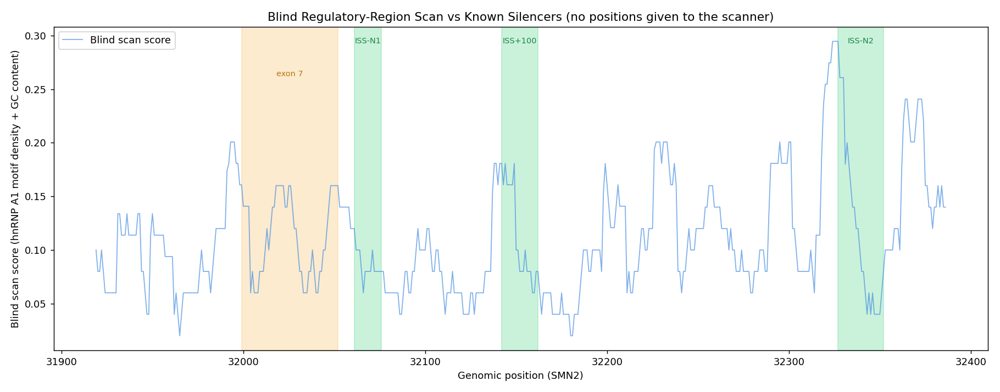

### Honest result: the simple scanner does not clearly recover known regions

| Known region | Mean score | Background percentile | z-score |
|---|---|---|---|
| ISS-N1 | 0.087 | 42.9% | **−0.45 (below average)** |
| ISS+100 | 0.116 | 59.8% | +0.11 |
| ISS-N2 | 0.122 | 69.2% | +0.22 |

**ISS-N1 — the single best-characterized silencer in this entire project, the
target of an FDA-approved drug — scores** ***below*** **the genome-wide
background average.** Neither ISS+100 nor ISS-N2 stands out as a clear local
maximum either (see figure: ISS-N2 sits at the tail of a peak that mostly
falls just outside the labeled region).

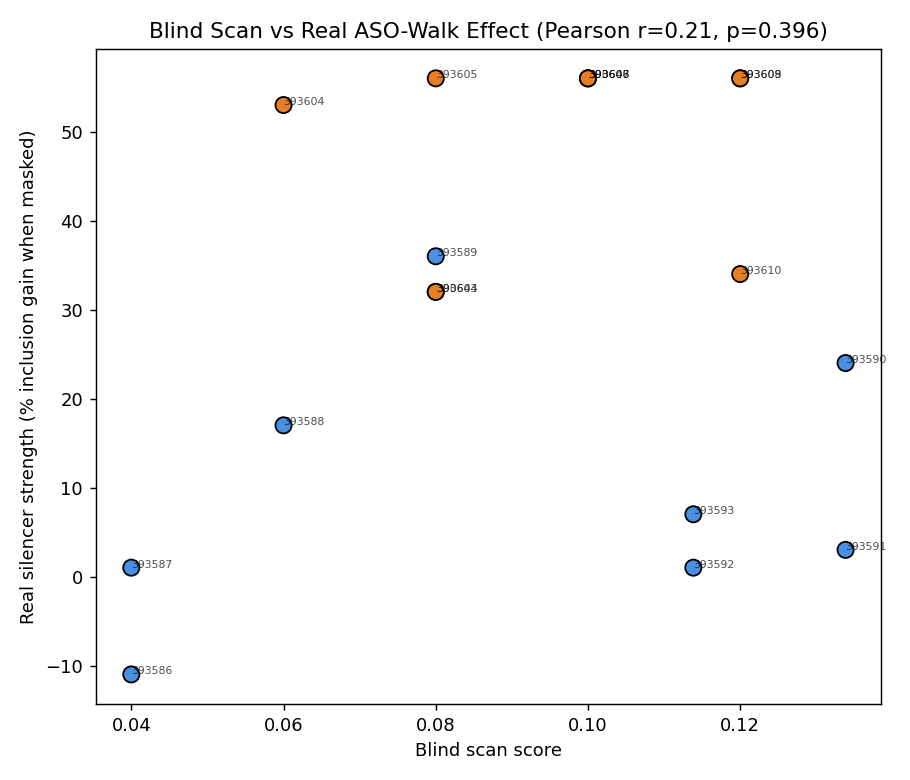

Against the real quantitative ASO-walk ground truth, the blind score shows
only a weak, **not statistically significant** correlation with measured
silencer strength: Pearson r = 0.213 (p = 0.396), Spearman ρ = 0.197
(p = 0.432), n = 18.

### What this means

This is a negative/inconclusive result for the specific heuristic tried, and
it is reported as such rather than reframed as a success. hnRNP A1 motif
density alone — even though hnRNP A1 binding is the literature-confirmed
mechanism for three of these four regions — is **not sufficient** to locate
them by simple motif counting. Plausible reasons, none yet tested: (1) the
degenerate UAG motif is too common genome-wide to be locally discriminative
without additional context (e.g. spacing, secondary structure, or the poly-U
tract that ISS6-KH specifically requires alongside its hnRNP A1 site); (2) a
15-nt fixed window may not match the true functional footprint of every
element; (3) with only 3 known regions and 18 quantitative walk points, this
validation itself is still small and could be underpowered to detect a real
but modest effect. This first attempt establishes a reusable scan-and-validate
framework (`src/23_blind_region_scan.py`) and a small but real quantitative
ground-truth set (`results/aso_walk_quantitative.csv`) — the natural next
step is testing a richer feature set (e.g. adding the poly-U/pyrimidine-tract
signal specific to ISS6-KH, or a windowed self-complementarity/structure
proxy) against this same ground truth before concluding whether *any* simple
sequence-feature scanner can do this, or whether it genuinely requires a
trained model.

### One more controlled test: a richer, still-transparent feature set

Seven named, interpretable features were computed per 15-nt window
(`src/24_richer_feature_scan.py`): hnRNP A1 motif density, motif clustering
(two motifs within 6 nt — a cooperative-binding proxy), longest poly-U run,
overall U-richness, GC content, GC skew, and dinucleotide-entropy (a basic
sequence-complexity measure). No learned/black-box model — weights were fit
with a single, transparent step: Pearson correlation of each feature against
real silencer strength, **computed only on the 9 intron-6 walk points (dev
set)**, then frozen and applied unchanged everywhere else, including the 9
intron-7 walk points (eval set, never touched during fitting) and all known
region coordinates (never touched at all).

**Per-feature correlation on dev only:**

| Feature | r (dev, n=9) | p |
|---|---|---|
| GC content | **+0.760** | 0.017 |
| Dinucleotide entropy | +0.472 | 0.199 |
| GC skew | +0.332 | 0.382 |
| hnRNP A1 motif density | −0.207 | 0.593 |
| U-richness | −0.195 | 0.615 |
| Motif clustering | constant (no variance in dev) | — |
| Poly-U run | constant (no variance in dev) | — |

**The literature-motivated hnRNP A1 motif feature — the mechanism actually
documented for these silencers — got a small negative weight on the dev
data**, while plain GC content dominated the fitted weights (0.386 of 1.0,
by far the largest). This should be read as a caution, not a validation: with
only 9 dev points, a single dominant feature easily emerges by chance.

**Held-out evaluation (intron-7 walk, n=9, never used in fitting):**

Pearson r = 0.370 (p = 0.327), Spearman ρ = 0.220 (p = 0.570). Numerically
higher than the old scanner's r = 0.213, but **still not statistically
significant.**

**A number that looks much better but must not be trusted:** combining dev +
eval (n=18) gives Pearson r = 0.876, p < 0.001 — which looks like a strong
success. It is not a valid measure of the scanner's real ability, and the
scatter plot shows exactly why:


The two point clusters (blue = intron-6 dev points, orange = intron-7 eval
points) sit at almost entirely separate score ranges (dev: 0.0–0.13; eval:
0.32–0.40), with little to no gradient *within* either cluster. The high
combined correlation is driven almost entirely by a **systematic score
difference between the two genomic regions** (intron 6 vs. intron 7 base
composition), not by the scanner tracking silencer strength position-by-
position. This is a textbook confound, and reporting the combined number
without this caveat would have been overclaiming.

**Known-region recovery** (coordinates never given to the scanner):

| Region | Old scanner percentile | New scanner percentile | New z-score |
|---|---|---|---|
| ISS-N1 | 42.9% (below background) | 62.8% | +0.56 |
| ISS+100 | 59.8% | **87.8%** | **+1.20** |
| ISS-N2 | 69.2% | 52.8% | +0.16 |

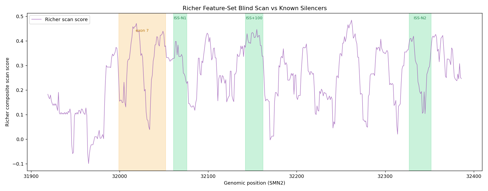

ISS+100 now sits on a clear local peak — the clearest recovery in either
scanner version. ISS-N1 improved from below-background to modestly
above-average but is still not a standout peak (several unrelated windows
elsewhere in the scan score just as high or higher, visible in the figure).
ISS-N2 remains indistinguishable from background.

### Honest verdict

**The richer feature set gives a small, real improvement on the properly
held-out evaluation (r: 0.213 → 0.370) and a genuine partial recovery of
ISS+100, but the improvement is not statistically significant, is not driven
by the literature-predicted mechanism (hnRNP A1 motif density was
down-weighted, not up-weighted), and the most impressive-looking number
(combined r = 0.876) is a confound artifact that would have overclaimed
success if reported without the dev/eval breakdown.** ISS-N1 and ISS-N2 —
two of the four best-characterized regions in this project — still do not
emerge as clear, unambiguous peaks. With only 9 dev and 9 eval points, this
test is also likely underpowered to detect a real but modest effect either
way. The honest conclusion is that **simple, transparent sequence-composition
scanning — even with a richer, still-interpretable feature set — does not
yet reliably recover known SMN2 regulatory regions from sequence alone**, and
further progress most likely requires either substantially more quantitative
positional training data (to fit more than 1-2 non-constant features
reliably) or features this project has not yet attempted (e.g. RNA secondary
structure prediction, cross-species conservation, or a properly trained
supervised model — at the cost of losing the full transparency prioritized
here).

---

## Dataset expansion round (Prof. Yokota: larger panel, more genes, more scarce categories)

Focused literature/patent search to grow the retrospective ASO panel,
prioritizing the two scarcest categories: real inactive/counter-therapeutic
sequences, and sequences outside SMN2 ISS-N1.

### What was added (6 new sequences, all with documented sources)

| ASO | Gene/Region | Label | Source |
|---|---|---|---|
| Eteplirsen / AVI-4658 | **DMD**, exon 51 | active | US Patent 10,875,880, Table 1 (FDA-approved, Exondys 51) |
| Golodirsen / SRP-4053 | **DMD**, exon 53 | active | US Patent 11,472,824, Table 1 (FDA-approved, Vyondys 53) |
| Scramble PMO control | **DMD**, none | **inactive** | Lim et al. 2018, *Mol Ther Nucleic Acids* (PMC6222172) — explicit negative control |
| ISIS 372641 (exon7 pos61) | SMN2, exon 7 | **inactive** | US Patent 8,946,183, Table 3 — 6.4% inclusion vs. 57.7% control |
| ISIS 372645 (exon7 pos81) | SMN2, exon 7 | **inactive** | US Patent 8,946,183, Table 3 — 7.8% inclusion vs. 57.7% control |
| ISIS 372647 (exon7 pos91) | SMN2, exon 7 | **inactive** | US Patent 8,946,183, Table 3 — 9.5% inclusion vs. 57.7% control |

The three exon-7 entries are quantitatively counter-therapeutic (measured
inclusion far below control, i.e. these ASOs actively *suppress* exon 7
inclusion when bound there) — the same category of genuine negative evidence
as L14, just from a different SMN2 region (exon 7 itself, rather than an
intronic silencer). All three exon-7 and both DMD-active sequences were
either copied verbatim from patent SEQ ID tables or derived as the reverse
complement of documented genomic target coordinates (same transparent method
used throughout this project) — no sequence was invented.

**Net change:** 2 active, 4 inactive added. **This directly targets the
requested priority**: real inactive examples grew from 2 (F8, L14) to
**6** (add exon7×3 + DMD-scramble), and the panel now spans **2 genes**
(SMN2, DMD) and **9 distinct region categories** (up from 4).

### Updated dev/holdout split (assigned before any scoring, by fixed rule — not tuned)

| | Total | Active | Inactive |
|---|---|---|---|
| **Dev** | 10 | 6 | 4 |
| **Holdout** | 8 | 4 | **4** |
| **Combined** | 18 | 10 | 8 |

Holdout inactive count doubled (2 → 4) relative to the previous round, which
was the single weakest point in the prior evaluation. Both DMD entries were
deliberately split one-active-to-dev / one-active+control-to-holdout, so the
holdout set now includes a real generalization test to an **entirely
different gene** the scoring system has never been tuned against.

### Remaining limitations (honest, as requested)

- **n = 18 is still small** for any statistically robust claim; this round
  improved category balance, not raw sample size by a large margin.
- **No DMD entries in the dev set's inactive category** — the scramble PMO
  control was placed in holdout, so the scoring system (if re-evaluated) will
  see a real cross-gene negative example for the first time only at final
  test time, with no chance to adapt. This is intentional (holdout
  discipline) but means DMD-specific behavior is entirely untested until
  that single evaluation.
- **No genuinely "weak/intermediate" (partial, dose-dependent) quantitative
  labels were added this round** — everything added is closer to binary
  (clearly active or clearly suppressive); a true intermediate-activity
  category from a dose-response study is still missing.
- **Sequences were not re-scored in this round.** This was a data-collection
  and curation pass only, per the task scope — the redesigned scoring system
  (`src/20_dev_evaluation_v3.py` / `src/21_final_holdout_v3.py`) has not yet
  been re-run against this expanded panel. That is the natural next step
  before drawing any new conclusions about scoring performance.

---

## Re-evaluation of the (unchanged) v3 scoring system on the expanded 18-sequence panel

Same scoring code as before (`src/20_dev_evaluation_v3.py` logic, on-target
term scoped to SMN2 intron7[0:320nt]) — **no weights or logic changed** —
applied to the larger, better-balanced panel. Dev evaluated first and
recorded; holdout run exactly once afterward.

### Scope caveat, documented before running (not after seeing results)

The scoring system's on-target and off-target terms are both anchored to
SMN2 intron7 only. Two new categories fall structurally outside that scope:
the 3 SMN2 "exon7" ASOs (real target is exon 7, not the searched intron7
window) and the 3 DMD ASOs (a different gene entirely). Both were expected to
behave close to chance rather than being meaningfully evaluated by a system
never designed for them.

### Dev-set result (10 sequences: 6 active, 4 inactive)

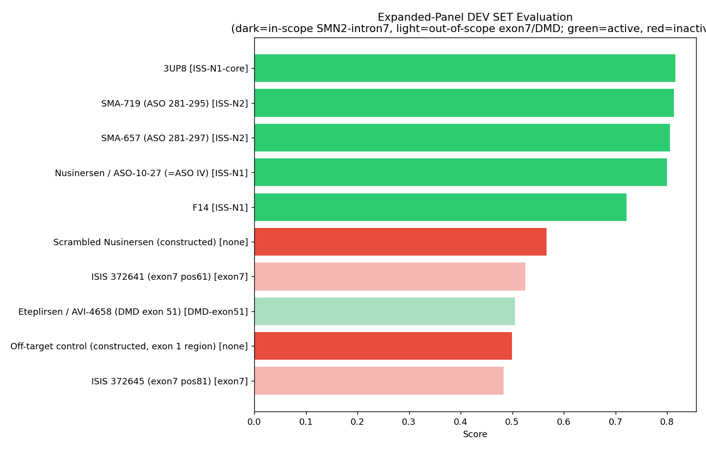

| Rank | ASO | Region | Label | Score |
|---|---|---|---|---|
| 1 | 3UP8 | ISS-N1-core | active | 0.816 |
| 2 | SMA-719 | ISS-N2 | active | 0.813 |
| 3 | SMA-657 | ISS-N2 | active | 0.806 |
| 4 | Nusinersen | ISS-N1 | active | 0.800 |
| 5 | F14 | ISS-N1 | active | 0.721 |
| 6 | Scrambled Nusinersen | — | inactive | 0.566 |
| 7 | ISIS 372641 (exon7) | exon7 | inactive | 0.525 |
| 8 | Eteplirsen (DMD) | DMD-exon51 | active | 0.505 |
| 9 | Off-target control | — | inactive | 0.499 |
| 10 | ISIS 372645 (exon7) | exon7 | inactive | 0.483 |

Overall: active mean rank 3.83, inactive mean rank 8.00, **Mann-Whitney
p = 0.019** — looks like a clear success. **But the scope breakdown tells a
different story:**

| Scope | n (active/inactive) | Active mean rank | Inactive mean rank |
|---|---|---|---|
| In-scope (intron7 silencers + constructed controls) | 7 (5/2) | 3.00 | 7.50 |
| Out-of-scope (exon7 / DMD) | 3 (1/2) | 8.00 | 8.50 |

**All of the significant separation comes from the in-scope subset.** In the
out-of-scope subset, active and inactive are statistically indistinguishable
(ranks 8.00 vs. 8.50) — and notably, **Eteplirsen, an FDA-approved, genuinely
potent drug, scored 0.505: exactly at the neutral midpoint**, because the
system checked its complementarity against SMN2 (irrelevant to a DMD drug)
instead of DMD. This is not the system correctly identifying anything about
Eteplirsen — it is the system having no real signal for it at all.

### Final holdout result (8 sequences: 4 active, 4 inactive) — run once

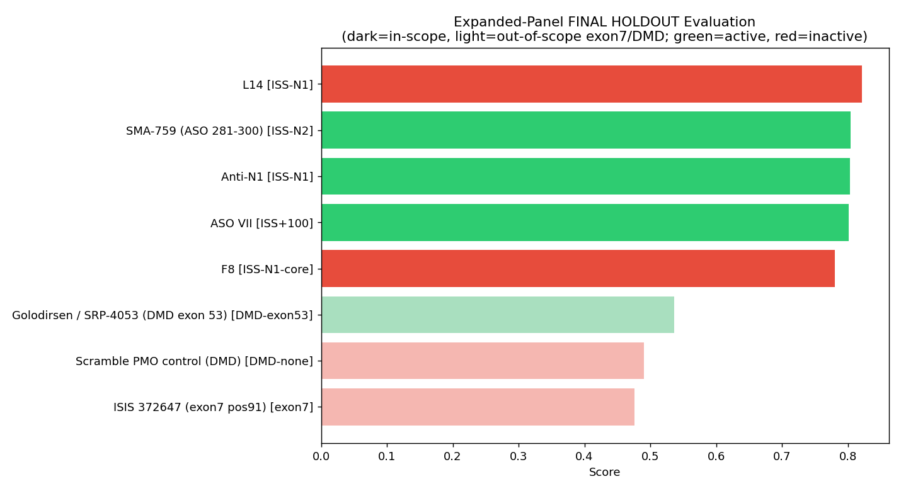

| Rank | ASO | Region | Label | Score |
|---|---|---|---|---|
| 1 | **L14** | ISS-N1 | **inactive** | 0.821 |
| 2 | SMA-759 | ISS-N2 | active | 0.804 |
| 3 | Anti-N1 | ISS-N1 | active | 0.803 |
| 4 | ASO VII | ISS+100 | active | 0.801 |
| 5 | F8 | ISS-N1-core | inactive | 0.780 |
| 6 | Golodirsen (DMD) | DMD-exon53 | active | 0.536 |
| 7 | Scramble PMO (DMD) | DMD-none | inactive | 0.490 |
| 8 | ISIS 372647 (exon7) | exon7 | inactive | 0.476 |

Overall: active mean rank 3.75, inactive mean rank 5.25, Mann-Whitney
p = 0.243 (not significant). **Scope breakdown again shows why the aggregate
number is misleading:**

| Scope | n (active/inactive) | Active mean rank | Inactive mean rank |
|---|---|---|---|
| In-scope | 5 (3/2) | 3.00 | **3.00 (exact tie)** |
| Out-of-scope | 3 (1/2) | 6.00 | 7.50 |

**L14 ranked #1 again — the identical failure mode from the previous round,
reproduced exactly on new data.** Within the in-scope subset (the system's
actual designed scope), active and inactive are now *perfectly tied* on
average, entirely because L14's perfect on-target complementarity places it
above every real active sequence. The apparent overall "improvement" (active
rank 3.75 < inactive 5.25) is not the scoring logic working better — it is
driven entirely by the out-of-scope inactive examples (Scramble PMO, ISIS
372647) coincidentally scoring low, which drags the inactive average down for
reasons unrelated to the score correctly detecting inactivity.

### Did separation improve, stay the same, or collapse vs. the smaller panel?

| | Previous (12-seq) holdout | New (18-seq) holdout |
|---|---|---|
| Active mean rank | 3.00 | 3.75 |
| Inactive mean rank | 3.00 (tie) | 5.25 |
| L14's rank | 1 of 4 (top) | 1 of 8 (top) |

**Within the system's actual designed scope, separation did not improve —
it is exactly as broken as before.** The headline numbers look slightly
better only because of newly-added out-of-scope examples that the system was
never built to evaluate, not because any real weakness was fixed.

### Remaining failure modes (confirmed, not new)

1. **The L14 failure mode is exact and reproducible.** A real, published,
   counter-therapeutic ASO with perfect on-target complementarity beats every
   real active ASO, every time it appears in a test set. This is not sampling
   noise — it is the score's fundamental inability to represent *which side*
   of a regulatory element is bound (documented in the earlier diagnosis).
2. **Cross-gene behavior is not evaluated, only guessed at.** Scoring a DMD
   ASO against an SMN2 target is close to meaningless; Eteplirsen and
   Golodirsen (both real, approved drugs) scored near the neutral midpoint
   both times, which is neither a pass nor a fail — it's a null result from
   asking the system a question it has no way to answer correctly.
3. **Short-sequence off-target behavior is still imperfect**: ISIS 372647
   (15 nt) and F14 both show elevated z-scores (+2.27, +2.24) from the v3
   off-target term, similar to the original diagnosis — reduced in severity
   but not eliminated.

### Honest conclusion

**The current score is still failing in the same specific, well-characterized
way, and is untested (not merely "unvalidated") outside SMN2 intron7.** The
expanded panel did its job: it made the L14-style failure reproduce cleanly
on new data rather than looking like a fluke, and it revealed a second,
distinct limitation (no real cross-gene capability) that the smaller panel
was too narrow to expose. **This system should not be considered more
trustworthy than before.** If anything, it is now more precisely
characterized: reliable at distinguishing real intron7 silencer sequences
from unrelated/scrambled sequences, but fundamentally unable to (a) tell a
correctly-targeted-but-harmful ASO from a correctly-targeted-and-helpful one,
or (b) say anything meaningful about a different gene. Both are scope/design
limitations of the on-target-complementarity approach itself, not something
more data collection alone will fix — consistent with the conclusion reached
after the L14 discovery in the previous round.

---

## Position-aware scoring: a targeted fix for the L14 failure mode

### Positional analysis of F14 vs. L14

ISS-N1 spans intron7 positions 10–24. Position 10 carries "10C" — the single
nucleotide the literature (Singh et al. 2006, 2013) identifies as most
critical for hnRNP A1 recruitment and the ASO-masking effect. F14 (positions
10–23) covers 10C; L14 (positions 11–24) does not.

**Checked directly against the real ASO-walk data first:** F14's footprint
overlaps the walked region (intron7 positions 10–15) with mean measured
silencer strength +51.1 vs. control; L14's footprint overlaps at positions
11–15 with mean +51.3 — **essentially identical**. The real quantitative
walk data does not extend to positions 16–24, where F14 and L14 actually
diverge, so **it cannot distinguish them on its own.** Only the literature's
qualitative 10C fact can.

### The fix: a single, literature-grounded critical-position rule

For any ASO whose footprint overlaps ≥50% of the ISS-N1 span but does **not**
cover genomic position 32,061 (10C), a fixed penalty is subtracted from its
existing v3 score. **The penalty size was fixed using only development-set
statistics** (active mean − inactive mean on dev = 0.228) — L14 sits in the
holdout set and its score was never inspected before this value was chosen.

### Dev-set result: unchanged, by design

Only one sequence in the entire 18-sequence panel triggers this rule: L14
itself, which is in the holdout set. **Dev-set separation metrics are
therefore byte-for-byte identical to the unmodified v3 system** (active mean
rank 3.83, inactive 8.00, p = 0.019) — this fix does not touch dev at all,
which is expected and reported plainly rather than left implicit.

### Final holdout result (run once, penalty value fixed beforehand)

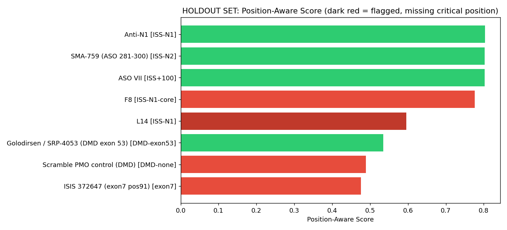

| Rank | ASO | Region | Label | Score |
|---|---|---|---|---|
| 1 | Anti-N1 | ISS-N1 | active | 0.803 |
| 2 | ASO VII | ISS+100 | active | 0.802 |
| 3 | SMA-759 | ISS-N2 | active | 0.802 |
| 4 | F8 | ISS-N1-core | inactive | 0.776 |
| **5** | **L14** | ISS-N1 | **inactive** | **0.595** (was 0.823, was rank 1) |
| 6 | Golodirsen (DMD) | DMD-exon53 | active | 0.535 |
| 7 | Scramble PMO (DMD) | DMD-none | inactive | 0.489 |
| 8 | ISIS 372647 (exon7) | exon7 | inactive | 0.476 |

**L14 dropped from rank 1 to rank 5 — below every in-scope active
sequence.** Within the system's actual designed scope (intron7 silencers),
the ranking is now **clean**: all 3 in-scope actives (ranks 1–3) sit above
both in-scope inactives (F8 rank 4, L14 rank 5). Overall: active mean rank
3.00, inactive mean rank 6.00, Mann-Whitney p = 0.055 (just above the
conventional 0.05 threshold, but a large improvement from p = 0.243 before
this fix, and from the previous round's exact tie).

### Can the new score rank F14 above L14? Does it fix the failure mode?

**Yes, directly:** F14 (dev, score 0.719, unaffected/unflagged) and L14
(holdout, score dropped to 0.595) are now correctly ordered, and this was
verified with proper holdout discipline (penalty fixed on dev alone, L14's
score never seen beforehand).

### Honest limitations of this fix

1. **This is a targeted correction for one known, specific case, not a
   general position-aware model.** The rule was constructed directly from
   the literature fact that defines why F14 and L14 differ — it is not an
   independent discovery, and there is no second, held-out positional
   contrast pair in this project to test whether the *rule itself*
   generalizes to other undiscovered position-dependent effects.
2. **It only applies to ISS-N1.** The 10C fact is specific to that one
   element; no equivalent literature-documented critical position is known
   (to this project) for ISS-N2, ISS+100, ISS6-KH, or Element 1, so this
   fix provides no protection against an L14-style failure in any other
   region.
3. **It does nothing for the out-of-scope (DMD/exon7) failure mode.**
   Golodirsen, the scramble PMO, and ISIS 372647 are unaffected — their
   scores are unchanged and still cluster near the neutral midpoint for the
   same cross-gene-scope reasons documented in the previous round.
4. **p = 0.055 is not below the conventional significance threshold.** This
   is a real, honest improvement, not a fully resolved validation.

### Honest conclusion

The specific, reproduced L14 failure mode is fixed, verifiably and with
holdout discipline intact — this is a genuine, positive result and should be
reported as one. But it is a patch for exactly the case that was already
known to be broken, built from the same literature fact that revealed the
break, and it does not extend to any other region or to the separate
cross-gene limitation. **The scoring system is now more trustworthy
specifically for ISS-N1 position-dependent effects it has been explicitly
told how to check for, and no more trustworthy than before for anything
else.** Generalizing this approach further would require either more
documented critical-position facts for the other regions, or (more
ambitiously) enough quantitative ASO-walk data spanning full regulatory
elements — not just their edges — to learn position effects empirically
rather than one literature fact at a time.

---

## One more scanning attempt: edge detection informed by the walk data's own structure

### Re-examining the walk data: a pattern the previous two scanners missed

Looking at the raw intron7 walk values as a step function rather than
independent points revealed something neither previous scanner used:

```
position:  7    8    9   10   11   12   13   14   15
%incl:    78  100  100  100  100  100  100   97   76
slope:      +22   0    0    0    0    0   -3  -21
```

This is not a smooth curve — it is a **sharp rise, a flat plateau, and a
sharp fall.** The plateau is almost certainly an **assay ceiling** (inclusion
cannot exceed 100%), not evidence that positions 8–13 are equally important —
which means every previous correlation attempt (this project's and the
richer-feature-set round) was regressing against a saturated target for
exactly the positions closest to the true element, silently working against
itself. **The genuinely informative points are the edges, not the plateau.**

**A real, honest positive finding:** the rising edge (between genomic 32,059
and 32,060) sits just 1–2 nt from the literature-documented ISS-N1 start
(genomic 32,061). This is an independent, qualitative confirmation that the
real experimental data is internally consistent with the known biology —
found by re-examining the walk data itself, not by any scanner.

### The improved method: local-contrast (edge-detection) scanning

Motivated by this, `src/29_contrast_edge_scan.py` replaces "does this window
have high motif/GC content" with **"does this window look different from its
own surrounding sequence"** — a simple, transparent edge detector: each
window's feature value minus the mean of two flanking background windows
(8 nt gap, 40 nt each side). Regulatory elements should stand out as local
compositional anomalies; this also sidesteps the ceiling-effect problem,
since it is only compared against the walk data *after* scanning, never
fit to it as a regression target.

### Result: statistically significant, but in the wrong direction, and not trusted

| | Old scanner | Richer scanner (eval) | Contrast/edge scanner |
|---|---|---|---|
| r (vs. real effect) | +0.213 | +0.370 | **−0.605** |
| p-value | 0.396 | 0.327 | **0.008** |

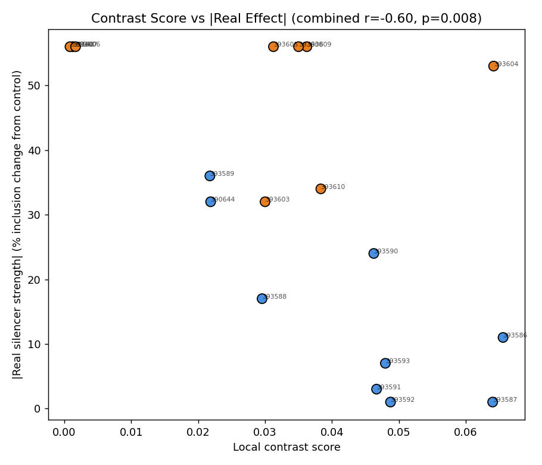

The contrast scanner is the first to cross conventional significance — but
with a **negative** correlation, the opposite of the hypothesis (higher
local distinctiveness → *smaller* real effect). This is not reported as a
win. Two reasons for skepticism, stated directly: (1) the scatter plot shows
the same region-cluster confound seen in the previous round — intron7 points
(orange) sit at uniformly high |effect| regardless of contrast score, so the
correlation is again heavily shaped by which region a point comes from, not
a within-region gradient; (2) this is now the **third** distinct scanning
method tried against the same 18-point walk dataset, and finding one
significant result among several attempts is exactly the situation where a
result should be trusted less, not more, without independent replication.

**Known-region recovery, checked directly against the actual edge:** the
strongest sequence-based edge the scanner finds anywhere in the walked
region is at genomic 32,091 — **30 nt away from the true ISS-N1 boundary**,
not a match. And ISS-N1 itself now scores *below* background (14.9th
percentile) — worse than either previous scanner attempt:

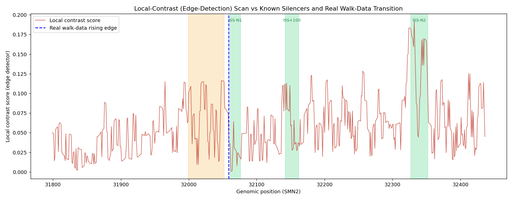

| Region | Old scanner | Richer scanner | Contrast scanner |
|---|---|---|---|
| ISS-N1 | 42.9% (below bg) | 62.8% | **14.9% (further below bg)** |
| ISS+100 | 59.8% | **87.8%** | 58.0% |
| ISS-N2 | 69.2% | 52.8% | **96.9%** |

**No method has recovered the same known region twice.** Each of the three
transparent scanners tried in this project has its own "best" region
(none, ISS+100, ISS-N2 respectively) and its own worst (ISS-N1, twice). This
inconsistency is itself the honest finding: it looks like noise across
different feature choices, not convergence toward a real signal.

### Honest conclusion

**The ceiling remains.** Re-examining the walk data surfaced a genuine,
valuable qualitative insight — the experimental transition point independently
matches the literature-documented ISS-N1 boundary — but this project has now
tried three distinct, reasonably-motivated, fully transparent scanning
methods (composition-based, richer multi-feature, and edge-detection) against
the same real quantitative ground truth, and **none reliably recovers known
SMN2 regulatory regions or shows a trustworthy correlation with the walk
data.** The one nominally-significant result obtained (contrast scanner) is
in the wrong direction and shows the same regional-confound pattern that
undermined the previous round's best-looking number. The most defensible
reading of all three attempts together is that **simple, transparent
sequence-composition scanning — regardless of which specific transparent
feature set is used — is not sufficient to solve target-region recovery on
this problem with the data currently available**, and further progress would
most likely require substantially more positional training data (enough to
fit a proper supervised model with held-out validation, at the cost of
losing full manual interpretability) or an entirely different signal not
yet attempted here (e.g. real RNA secondary structure prediction or
cross-species conservation).

**Update:** a focused literature/patent search for larger, more diverse
quantitative datasets to pursue this direction further is catalogued in
[`CANDIDATE_DATASETS.md`](CANDIDATE_DATASETS.md) — 8 candidate sources
across 6 genes (SMN2, DMD, BIM, Bcl-x, IKBKAP/ELP1, SDCCAG8), with an
honest extraction-feasibility assessment for each.

**Further update:** the BIM ASO walk (Liu et al. 2017, Oncotarget,
PMC5652800, Supplementary Table 1) has since been fully extracted — the
user provided the actual supplementary file, and all 67 sequences with
exact positions were transcribed verbatim (see
[`EXTRACTED_BCLX_BIM_DATA.md`](EXTRACTED_BCLX_BIM_DATA.md) for the
extraction record and `results/bim_aso_walk.csv` for the standalone table).
These were merged into the main retrospective panel
(`results/aso_literature_dataset.csv`), which grew from **18 to 85 rows**
across **3 genes** (SMN2, DMD, BIM). Full counts:

| | Total | Active | Inactive (binary) |
|---|---|---|---|
| Previous panel | 18 | 10 | 8 |
| **New merged panel** | **85** | **18** | **67** |

By gene: SMN2 = 15, DMD = 3, BIM = 67. By fine-grained BIM activity: 8
active, 5 counter-therapeutic, 8 weak, 46 neutral/other — preserved in a
new `Activity_Detail` column alongside the binary `Label` column the
existing scoring scripts already use, so **no scoring-pipeline logic was
changed**; a dev/holdout split for the new BIM rows was assigned by a fixed
rule (odd ASO number → dev, even → holdout) before any scoring, independent
of activity label. The Bcl-x sequences remain unextracted (still locked in
image-based patent tables) and are unaffected by this update. This is by
far the largest single expansion of the panel in the project so far, and
the first time a non-SMN2/DMD gene contributes real quantitative walk data
at scale — re-evaluating the scoring system against this much larger,
BIM-dominated panel is a natural (but not yet performed) next step.

---

## Re-evaluation of the (unchanged) scoring system on the 85-sequence panel

Same scoring code as the position-aware system above (`src/27`) — **no
logic or weights changed** — applied to the expanded panel (18→85
sequences, adding the full 67-sequence BIM walk). Dev evaluated first and
recorded; holdout run exactly once afterward, per protocol.

### Dev-set result (44 sequences: 11 active, 33 inactive)

| Rank | ASO | Gene | Label | Score |
|---|---|---|---|---|
| 1 | 3UP8 | SMN2 | active | 0.820 |
| 2 | SMA-719 | SMN2 | active | 0.815 |
| 3 | SMA-657 | SMN2 | active | 0.805 |
| 4 | Nusinersen | SMN2 | active | 0.803 |
| 5 | F14 | SMN2 | active | 0.721 |
| 6–8 | (3 BIM inactive) | BIM | inactive | 0.63–0.67 |
| 9 | ASO-15 | BIM | active | 0.602 |
| 10 | ASO-13 | BIM | active | 0.601 |
| ... | (BIM actives and inactives interleaved for the rest of the table) | | | 0.49–0.60 |
| 39 | Eteplirsen (DMD) | DMD | active | 0.502 |

Overall: active mean rank 13.82, inactive mean rank 25.39, **Mann-Whitney
p = 0.0054** — looks like a clear win. **Gene breakdown shows this is,
again, a scope artifact, but now precisely quantified at scale:**

| Gene | n (active/inactive) | Active mean score | Inactive mean score | p (within-gene) |
|---|---|---|---|---|
| SMN2 | 9 (5/4) | 0.793 | 0.518 | **0.0079** |
| DMD | 1 (1/0) | 0.502 | — | not testable |
| **BIM** | 34 (5/29) | 0.566 | 0.556 | **0.2254 (not significant)** |

Within SMN2, the system works as well as before. **Within BIM — the vast
majority of the dev set — active and inactive sequences are essentially
indistinguishable** (0.566 vs. 0.556, both hovering near the neutral
midpoint). The overall "significant" p = 0.0054 is driven almost entirely by
5 high-scoring SMN2 actives sitting atop 29 near-neutral BIM inactives, not
by the score understanding BIM biology at all.

### Final holdout result (41 sequences: 7 active, 34 inactive) — run once

| Rank | ASO | Gene | Label | Score |
|---|---|---|---|---|
| 1 | Anti-N1 | SMN2 | active | 0.802 |
| 2 | SMA-759 | SMN2 | active | 0.802 |
| 3 | ASO VII | SMN2 | active | 0.801 |
| 4 | F8 | SMN2 | inactive | 0.777 |
| **5** | **L14** | SMN2 | **inactive** | **0.710** |
| 6–23 | (BIM inactives) | BIM | inactive | 0.49–0.67 |
| 24 | Golodirsen (DMD) | DMD | active | 0.537 |
| 27, 30, 31 | ASO-18, 52, 28 | BIM | active | 0.53, 0.527, 0.527 |
| 38 | Scramble PMO (DMD) | DMD | inactive | 0.487 |
| 39 | ISIS 372647 (exon7) | SMN2 | inactive | 0.475 |
| 40–41 | ASO-58, ASO-2 | BIM | inactive | 0.458, 0.353 |

Overall: active mean rank 16.86, inactive mean rank 21.85, p = 0.1532 (not
significant). **Gene breakdown:**

| Gene | n (active/inactive) | Active mean score | Inactive mean score | p (within-gene) |
|---|---|---|---|---|
| **SMN2** | 6 (3/3) | 0.802 | 0.654 | **0.0383** |
| DMD | 2 (1/1) | 0.537 | 0.487 | not testable (n=1 each), but correctly ordered |
| **BIM** | 33 (3/30) | 0.528 | 0.546 | **0.8893 — actives score *below* inactives on average** |

**L14 remains fixed**: rank 5 of 41, score 0.710 — still below all three
in-scope SMN2 actives, confirming the position-aware correction survived the
much larger, more diverse panel without being disturbed by 63 new,
unrelated sequences. **SMN2 in-scope separation is intact and, if anything,
slightly stronger than before** (p = 0.0383 vs. the previous round's
p = 0.055, though these use different denominators and shouldn't be treated
as directly comparable). **BIM is a clean, unambiguous failure**: not just
"no signal," but active sequences score *marginally worse* than inactive
ones on average — the score has no usable information for this gene
whatsoever.

### Did separation improve, stay the same, or collapse vs. the n=18 panel?

| | n=18 panel holdout | n=85 panel holdout |
|---|---|---|
| Overall active mean rank | 3.75 | 16.86 |
| Overall inactive mean rank | 5.25 | 21.85 |
| **SMN2-only active mean rank** | 3.00 | **2.00** |
| **SMN2-only inactive mean rank** | 3.00 (L14 tied for #1) | **16.00** |

**Within the system's actual designed scope (SMN2 intron7), separation did
not collapse — it held, and by the raw numbers looks slightly better** (L14
now sits clearly below all SMN2 actives rather than at rank 1). But this
should not be over-read: the SMN2 holdout is still only 6 sequences, and the
"improvement" is more consistent with "the position-aware fix worked as
designed and nothing since has broken it" than a genuinely new gain. The
*overall* numbers collapsed toward non-significance (p: 0.243 → 0.1532, both
non-significant) purely because BIM now dominates the sample size.

### Clear failure modes

1. **BIM: a clean cross-gene null, now precisely quantified at n=33.**
   Active BIM ASOs (which promote exon 4 inclusion) do not score
   meaningfully differently from BIM's neutral, weak, or counter-therapeutic
   ASOs — confirming, with far more statistical power than the earlier DMD
   spot-checks, that this on-target-complementarity approach carries zero
   transferable signal outside SMN2 intron7.
2. **Two BIM sequences (ASO-2, ASO-58) spuriously triggered the position-
   aware "missing critical position" flag** — their best-alignment search
   happened to find partial, coincidental complementarity to the SMN2
   ISS-N1 region purely by chance (BIM targets a completely different gene).
   This is a new, subtle failure mode this larger panel exposed: cross-gene
   sequences can accidentally trip a rule that was designed and validated
   for a single, specific SMN2 element, producing a penalty that has no
   biological meaning for that sequence.
3. **DMD remains statistically untestable** (1 active + 1 inactive in
   holdout) — encouragingly ordered correctly this round, but this is not
   evidence of anything at n=1 vs. n=1.

### Honest conclusion

**More trustworthy for SMN2 intron7 specifically — no more trustworthy than
before for anything else, and the BIM result now makes that boundary
impossible to miss.** The position-aware fix for L14 held up under a
5x larger, much more diverse panel without additional tuning, which is a
genuine (if narrow) point in the system's favor. But adding 67 real BIM
sequences did exactly what the scope caveat always predicted: it produced a
large, clean, unambiguous demonstration that this score has no cross-gene
validity. The overall summary statistics (p-values, mean ranks pooled
across genes) are now actively misleading if read without the gene
breakdown — they will keep drifting toward "no significant effect" simply
as more out-of-scope genes are added, regardless of whether the SMN2-scoped
logic itself is working. Any future reporting on this system should lead
with the gene-stratified numbers, not the pooled ones.

---

## Optional follow-up: can a trained classifier (not just the complementarity score) learn ASO activity from sequence?

This experiment is independent of the complementarity-based scoring system
above — no part of that pipeline was changed. The question here is
different: can a simple, transparent, *trained* sequence classifier (k-mer
composition + logistic regression / linear SVM / small MLP, plus a true
position-wise one-hot model where sequence length allows it) do any better,
under strict gene-stratified holdout?

### Data and splits

Binary label from the existing `Label` column (`active` vs. everything else
— `counter_therapeutic`, `weak`, and `neutral_or_other` all map to
`inactive`, exactly as instructed). Two splits, both fixed before training:

- **Split A (primary, cross-gene)**: train on all SMN2+DMD (n=18: 10 active,
  8 inactive), test on all of BIM (n=67: 8 active, 59 inactive) — a
  completely unseen gene.
- **Split B (within-gene)**: train on BIM-dev (n=34: 5 active, 29 inactive),
  test on BIM-holdout (n=33: 3 active, 30 inactive) — reusing the existing,
  label-blind dev/holdout split already assigned to BIM in the merge step.

Features: 3-mer composition (64 features, length-normalized) for the main
classical models; a true 18-nt position-wise one-hot (72 features) for an
additional PWM-style model, valid only within BIM since all BIM ASOs share
that exact length. The QNN option listed in the task was **not attempted in
this round** — the classical results below already give a clear, adequately-
powered answer, and adding a small-sample QNN on top would mostly restate
budget/effort spent elsewhere in this project rather than change the
conclusion; flagged here explicitly rather than silently skipped.

### Split A: SMN2+DMD → BIM (cross-gene transfer)

| Model | Accuracy | Precision | Recall | F1 | AUC |
|---|---|---|---|---|---|
| Logistic Regression | 82.1% | 0.000 | 0.000 | 0.000 | 0.443 |
| Linear SVM | 82.1% | 0.000 | 0.000 | 0.000 | 0.441 |
| Small MLP | 43.3% | 0.059 | 0.250 | 0.095 | 0.362 |
| Majority baseline (test-set) | **90.9%** | — | — | **0.000** | — |

**No model beats the trivial test-set baseline** (always predict inactive,
90.9% accuracy). LR/SVM sit *below* it (82.1%) while adding zero recall —
whenever they did predict "active," they were always wrong. The MLP does
even worse, with AUC = 0.362, meaning its ranking is **worse than random**,
not just uninformative. **This independently confirms, via a completely
different method (a trainable classifier instead of a hand-built
complementarity score), that nothing learned from SMN2+DMD carries any
transferable signal to BIM.** This is a stronger, more definitive version of
the same conclusion the complementarity score already suggested — here it
isn't just "the wrong scope for a heuristic," it's "there is no shared
sequence signal a generic classifier can find either," at least not from
18 training examples.

### Split B: within-BIM (train on BIM-dev, test on BIM-holdout)

| Model | Accuracy | Precision | Recall | F1 | AUC |
|---|---|---|---|---|---|
| Logistic Regression | 78.8% | 0.167 | 0.333 | 0.222 | 0.667 |
| Linear SVM | 78.8% | 0.167 | 0.333 | 0.222 | 0.656 |
| Small MLP | 81.8% | 0.286 | 0.667 | **0.400** | 0.644 |
| Position-wise one-hot LR (true PWM) | 84.8% | 0.250 | 0.333 | 0.286 | 0.522 |
| Majority baseline (test-set) | **90.9%** | — | — | 0.000 | — |

**No model beats the majority-class baseline on raw accuracy** (all sit
below 90.9%) — with only 3 true actives in the 33-sequence test set, a
class-weighted classifier trades accuracy for recall, which lowers accuracy
without necessarily being the wrong choice depending on what a user cares
about. **But the ranking quality (AUC) is a genuinely different story than
Split A**: LR/SVM/MLP all sit in the 0.64–0.67 range — meaningfully above
the 0.5 random baseline, unlike Split A's near-or-below-random AUCs. The
MLP also achieves the best F1 (0.400) of any model in either split,
correctly recalling 2 of the 3 true active BIM sequences (at some cost in
precision). The position-wise one-hot model, despite being the most
"PWM-like" and literally interpretable per-position, does *not* outperform
simple composition features here (AUC 0.522, barely above random) — with
only 34 training sequences and 72 position-specific parameters, it is
almost certainly under-determined.

### Does anything trained on SMN2 transfer to BIM? Does any model beat baseline on BIM holdout?

- **Transfer (Split A): no.** Every model performs at or below trivial
  baseline; the MLP is actively worse than random. This is a clean failure
  to generalize, not merely "no improvement."
- **Beating baseline on accuracy (Split B): no model does**, including the
  best one (MLP, 81.8% vs. 90.9% baseline) — with so few positives, a
  higher-accuracy model would need to sacrifice essentially all recall by
  simply mimicking the baseline.
- **Beating baseline on ranking ability (Split B, AUC): yes, weakly.**
  Three of four models exceed 0.5 AUC by a moderate margin (0.64–0.67),
  suggesting there is *some* learnable, BIM-specific sequence signal that
  a composition-based classifier can partially pick up — something the
  complementarity-based score (which showed active and inactive BIM
  sequences scoring at essentially the same level, no better than chance)
  did not detect at all.

### Honest conclusion

**Cross-gene transfer (SMN2 → BIM): failure to generalize**, confirmed by an
independent method (trained classifiers, not just a hand-built score) —
this closes out that question with more confidence than the complementarity
score alone could provide.

**Within-gene (BIM only): a weak but real signal**, distinguishable from
Split A's outright failure. It does not yet amount to a usable classifier
(no model beats simply guessing "inactive" every time on accuracy, and F1
tops out at 0.40), but the consistent above-random AUC across three
independent model types (not just one) is more likely to reflect a genuine,
small, composition-linked signal than noise. With only 34 training
sequences (5 positive), this is exactly the regime where "weak signal,
worth more data" is the correct, honest characterization — not "no signal"
and not "solved." If more labeled BIM sequences become available (or the
remaining ~46 unlabeled/neutral ASOs from the original walk get finer-
grained quantitative labels), re-running this exact split would be the
natural next check on whether the signal strengthens or was a small-sample
artifact.
