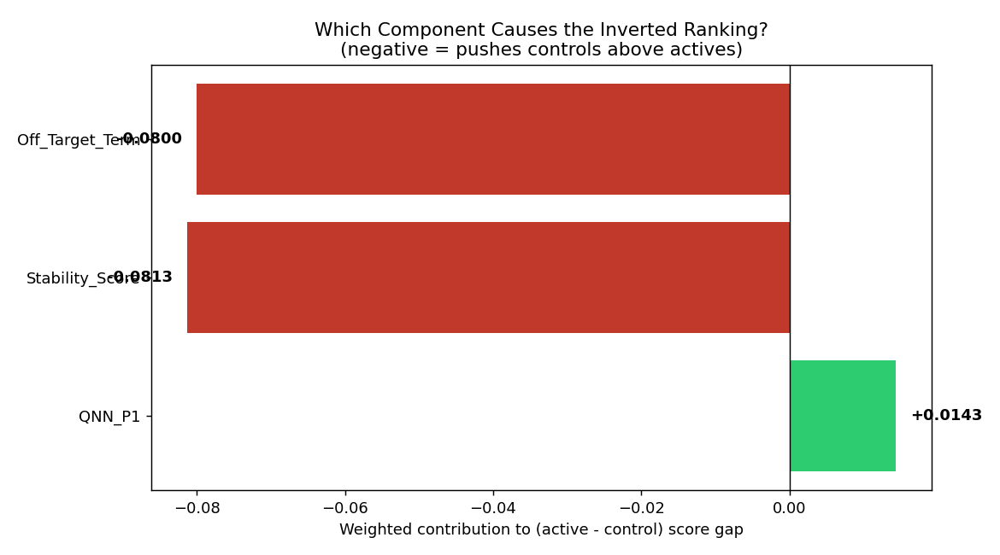

# Quantum Neural Networks for SMN2 Splice-Site Prediction and ASO Candidate Design

A from-scratch pipeline comparing classical and quantum machine learning models for
predicting RNA splice sites across five human genes, applied to antisense
oligonucleotide (ASO) candidate scoring for SMN2 exon-7 inclusion therapy.

## About this project

I'm a high school student in Turkey with a strong interest in computational biology,
quantum machine learning, and their intersection with genetic medicine — this project
grew out of curiosity about Spinal Muscular Atrophy (SMA) and the ISS-N1 splicing
mechanism that nusinersen (Spinraza) exploits therapeutically. I built the full
pipeline myself, from raw NCBI sequence data to trained quantum circuits, without
using pre-built bioinformatics libraries for the core splice-site detection logic.

## What was done

1. **Real, multi-gene ground truth.** Genomic and mRNA sequences for five genes
   (SMN2, BRCA1, TP53, CFTR, HBB) were aligned using a k-mer seed-and-extend
   algorithm to recover exact exon/intron boundaries. All 68/68 introns found were
   independently confirmed against the canonical GT...AG splicing rule — no labels
   were assumed or hand-picked.
2. **Quantum feature encoding.** Nucleotide windows around each splice site were
   mapped to Bloch-sphere rotation angles and fed into a 4-qubit (and, in ablation
   experiments, 2/6/8-qubit) parametric quantum circuit trained under a simulated
   IBM hardware noise model.
3. **Systematic model comparison**, all on the same stratified train/test split:
   - A majority-class baseline
   - Classical SVM and MLP (matched to the same feature budget as the QNN)
   - The trained QNN
   - A from-scratch Position Weight Matrix (PWM) classifier using the full
     22-nt window
   - A from-scratch 1st-order Markov (Weight Array Model) classifier — the
     methodological precursor to MaxEntScan
4. **Robustness checks:** a qubit-count ablation (2/4/6/8 qubits), 5-fold
   cross-validation on the best-performing quantum configuration, and four
   class-balancing strategies (random oversampling, SMOTE, random undersampling,
   class weighting).
5. **Dynamic ASO candidate scoring** for the SMN2 ISS-N1 region, combining the
   trained QNN's output probabilities with a real nearest-neighbor thermodynamic
   free-energy calculation and an off-target alignment scan — no hardcoded scores.

**Key finding:** the trained QNN performed comparably to classical general-purpose
ML models (SVM, MLP) under an identical, limited feature budget, but a much simpler
domain-specific model — a plain PWM using the *full* sequence window — outperformed
all of them by a wide margin. Cross-validation further showed that any single-split
advantage the QNN appeared to have over classical models did not hold up under
repeated resampling. The central conclusion of this project is therefore **not**
about quantum vs. classical superiority, but about **matching model complexity to
the amount of real biological ground truth available** — a lesson that emerged
directly from the data, not assumed in advance.

## Main results

All models evaluated on an identical stratified 80/20 train/test split (test set:
108 windows, 27 positive).

| Model | Accuracy | Precision | Recall | F1 |
|---|---|---|---|---|
| Baseline (majority class) | 75.0% | 0.000 | 0.000 | 0.000 |
| SVM (4 features) | 63.0% | 0.324 | 0.444 | 0.375 |
| MLP (4 features) | 54.6% | 0.225 | 0.333 | 0.269 |
| QNN (4 qubits) | 54.6% | 0.280 | 0.519 | 0.364 |
| **PWM (0th-order, full window)** | **86.1%** | **0.731** | **0.704** | **0.717** |
| MaxEnt-like (1st-order Markov/WAM) | 81.5% | 0.684 | 0.481 | 0.565 |

See `figures/final_comparison.png` for the corresponding plot and
`results/final_comparison.csv` for the raw numbers.


### Qubit-count ablation (2 / 4 / 6 / 8 qubits)

The main QNN result above uses 4 qubits. To test whether more qubits (i.e. more of
the 22-nt window) improve the quantum model, four configurations were trained on
an identical, class-balanced 100-sample training subset and evaluated on the same
108-sample test set:

| Qubits | Layers | Params | Accuracy | Precision | Recall | F1 | Training time |
|---|---|---|---|---|---|---|---|
| 2 (pooled) | 1 | 4 | 61.1% | 0.333 | 0.556 | 0.417 | 5.5s |
| 4 (truncated) | 2 | 16 | 44.4% | 0.254 | 0.630 | 0.362 | 6.6s |
| 6 (truncated) | 2 | 24 | 44.4% | 0.280 | 0.778 | 0.412 | 16.4s |
| 8 (truncated) | 2 | 32 | 49.1% | 0.267 | 0.593 | 0.368 | 145.4s |


F1 does not increase monotonically with qubit count — 6 qubits gives the best
F1/training-time trade-off, and 8 qubits is ~9x slower than 6 for a *lower* F1.
This is consistent with the project's central finding: more capacity does not
help without more data.

### Full classical-vs-quantum comparison at every qubit count

The same 2/4/6/8-feature budgets were also given to SVM and MLP (trained on the
same balanced 100-sample subset), so every model is compared under an identical,
matched feature count:

| Qubits | Baseline F1 | SVM F1 | MLP F1 | QNN F1 |
|---|---|---|---|---|
| 2 | 0.000 | 0.339 | 0.400 | 0.417 |
| 4 | 0.000 | 0.250 | 0.371 | 0.362 |
| 6 | 0.000 | 0.289 | 0.371 | 0.412 |
| 8 | 0.000 | 0.296 | 0.320 | 0.368 |


 The 2-feature MLP result is degenerate (100% recall, 25% accuracy — it predicts
"positive" for every sample) and should not be read as genuine skill. Excluding
that cell, QNN is the top or joint-top F1 at every remaining qubit count on this
particular split — but see the cross-validation result below before drawing any
conclusion from that.

### Is the QNN's edge real? 5-fold cross-validation (6-qubit configuration)

Because the table above comes from a single train/test split, the 6-qubit result
was re-run under 5-fold stratified cross-validation to check whether QNN's
apparent advantage holds up:

| Model | F1 (mean ± std across 5 folds) |
|---|---|
| Baseline | 0.000 ± 0.000 |
| SVM | 0.356 ± 0.032 |
| **MLP** | **0.391 ± 0.013** |
| QNN | 0.337 ± 0.060 |


Under cross-validation, QNN's fold-to-fold standard deviation (0.060) is larger
than its mean gap to MLP (0.054) — so the single-split "QNN wins" result above did
**not** replicate. This is the direct evidence behind this project's claim that no
quantum advantage is supported by the data.

### Class-balancing experiments (4-qubit configuration)

Four balancing strategies were tested on the training set only (test set always
kept in its original, imbalanced form):

| Technique | SVM F1 | MLP F1 | QNN F1 |
|---|---|---|---|
| Original (imbalanced) | 0.000 | 0.059 | 0.325 |
| Random Oversampling | 0.413 | 0.395 | 0.426 |
| SMOTE | 0.388 | 0.395 | 0.341 |
| Random Undersampling | 0.409 | 0.433 | 0.418 |


Balancing is critical for SVM/MLP (both are near-useless without it: SVM collapses
to predicting the majority class every time) but far less important for the QNN,
whose probability-regression loss (MSE against soft labels) already behaves more
gracefully under imbalance than a hard decision-boundary classifier.

---

## Follow-up analysis (Professor Toshifumi Yokota's feedback)

Three further experiments were run in response to external review, before any
wet-lab or preprint steps were considered.

### 1. Fair comparison under a matched, center-aligned feature window

The original comparison gave SVM/MLP/QNN only 4 *left-flanking* positions of the
22-nt window, while PWM used the full window. Two problems were fixed at once:
the feature *count* was matched (8 positions for every model), and the feature
*location* was corrected to be centered on the actual GT/AG splice motif
(positions 7–14 of the window) rather than uninformative flanking sequence.

| Model | Feature window | Accuracy | Precision | Recall | F1 |
|---|---|---|---|---|---|
| Baseline | 8nt (centered) | 75.0% | 0.000 | 0.000 | 0.000 |
| SVM | 8nt (centered) | 77.8% | 0.545 | 0.667 | **0.600** |
| MLP | 8nt (centered) | 83.3% | 0.645 | 0.741 | **0.690** |
| QNN | 8nt (centered) | 40.7% | 0.175 | 0.370 | 0.238 |
| PWM | 8nt (centered) | 86.1% | 0.731 | 0.704 | 0.717 |
| MaxEnt-like | 22nt (full, reference) | 81.5% | 0.684 | 0.481 | 0.565 |


**Correcting feature location, not just feature count, closed most of the gap
between classical ML and PWM** (SVM 0.375→0.600, MLP 0.269→0.690) — confirming
that earlier "classical ML is weak" conclusions were substantially an artifact of
poor feature placement, not a fundamental limitation of SVM/MLP. The QNN, given
the exact same improved features, got *worse* (0.364→0.238), which is a separate
finding: the quantum training procedure itself (fixed iteration budget, 100-sample
subset, COBYLA optimizer) appears to be the current bottleneck for the QNN, not
feature availability. Extending to the full 22-qubit window was not computationally
tractable in this environment (Hilbert space scales as 2^n; 22 qubits is far
beyond what shot-based simulation can train in reasonable time here), so 8 qubits
(centered) is used as the practical fair ceiling.

### 2. Gene-level holdout evaluation

All five models were retrained on **4 of the 5 genes** and tested on the entirely
unseen 5th gene, repeated once per held-out gene — a much stricter generalization
test than the earlier random split, since no window from the test gene is ever
seen during training.

| Held-out gene | N_test (positive) | Baseline F1 | SVM F1 | MLP F1 | QNN F1 | PWM F1 |
|---|---|---|---|---|---|---|
| SMN2 | 96 (16) | 0.000 | 0.409 | 0.465 | 0.328 | 0.595 |
| BRCA1 | 124 (44) | 0.000 | 0.714 | 0.690 | 0.393 | 0.773 |
| TP53 | 100 (20) | 0.000 | 0.583 | 0.698 | 0.261 | 0.714 |
| CFTR | 132 (52) | 0.000 | 0.736 | 0.714 | 0.477 | 0.812 |
| HBB | 84 (4) | 0.000 | 0.121 | 0.222 | 0.136 | 0.400 |
| **Mean ± std** | | 0.000 | 0.513 ± 0.228 | 0.558 ± 0.191 | 0.319 ± 0.116 | **0.659 ± 0.149** |


PWM remains the strongest generalizer even when it has never seen a single window
from the test gene, and QNN remains the weakest, consistent with the random-split
results above. HBB is the hardest holdout for every model (only 4 positive
examples total, so its held-out test set is extremely small and noisy) — its
numbers should be read with that caveat in mind.

### 3. Retrospective validation of the ASO scoring pipeline

Before scoring any new candidates, the existing QNN + thermodynamic + off-target
pipeline was tested against **real, published SMN2 ISS-N1-targeting ASOs** with
known biological activity, alongside constructed negative controls:

| Rank | ASO | Category | Combined score |
|---|---|---|---|
| 1 | Off-target control (unrelated SMN2 region) | control | 0.732 |
| 2 | ISS-N2-targeting ASO (different silencer) | control | 0.711 |
| 3 | Scrambled control (constructed) | control | 0.659 |
| 4 | Anti-N1 (Singh et al. discovery ASO) | **active** | 0.645 |
| 5 | Nusinersen / ASO-10-27 (FDA-approved) | **active** | 0.629 |
| 6 | 8-mer GC-core ASO (Singh et al. 2009 target region) | **active** | 0.386 |


**This is a negative result and it is the most important finding in this
follow-up analysis.** The published, experimentally active ASOs — including
nusinersen itself, an FDA-approved drug — rank *below* every constructed control,
including a scrambled sequence. Mean rank: active = 5.0, control = 2.0 (lower is
better), the reverse of what a working pipeline should show; a Mann-Whitney U
test finds no separation in the correct direction (p = 1.0). Root causes, diagnosed
directly from the component scores: (1) the QNN's P(1) output is clustered tightly
around 0.49–0.56 for every sequence tested — consistent with its weak, near-baseline
discriminative power seen throughout this project — so it contributes almost no
useful signal; (2) the thermodynamic stability term is driven mostly by GC content,
which happens to be high in the off-target and ISS-N2 controls for reasons
unrelated to ISS-N1 binding; (3) the off-target scan penalizes the short, real
8-mer core ASO heavily, because a short sequence matches more windows by chance
in *any* local scan — the opposite of its real published behavior, where shorter
ASOs are known to have *fewer* off-target effects due to lower mismatch tolerance.

**Conclusion: the current scoring pipeline should not be used to prioritize ASO
candidates for synthesis or wet-lab testing.** This retrospective check was
exactly the right precaution to run before that step, and it shows the scoring
system needs a substantial redesign — likely starting with a better QNN (per
points 1–2 above) and a real local-alignment-based off-target metric — before it
can be trusted on unseen candidates.

---

## ASO scoring system: diagnosis and redesign

### Diagnosis: why did the old score invert active vs. control?

Each component's weighted contribution to the (active − control) score gap was
computed directly (`src/14_diagnose_scoring_failure.py`):

| Component | Active mean | Control mean | Weighted contribution to gap | Direction |
|---|---|---|---|---|
| QNN P(1) | 0.527 | 0.498 | **+0.0143** | correct |
| Thermodynamic "stability" | 0.611 | 0.882 | **−0.0813** | inverted |
| Off-target term | 0.533 | 0.933 | **−0.0800** | inverted |




Ranking by the QNN component *alone* actually separates active from control
correctly (mean rank 2.0 vs 5.0 — the best possible outcome for 3-vs-3), but its
raw score gap is tiny (+0.029) so its weighted contribution is small. The
stability and off-target terms are both larger in magnitude and both point the
wrong way, so they dominate the combined score. Tracing the code (not just the
statistics) found the mechanistic causes:

1. **The thermodynamic term computed the ASO's self-complementary duplex energy**
   (a generic function of GC content) rather than its duplex energy with the
   *actual* ISS-N1 target — so it rewarded GC-rich sequences regardless of
   whether they matched ISS-N1 at all.
2. **The off-target scan penalized correctly-working ASOs for finding their own
   real target.** Confirmed by direct trace: nusinersen's *only* "off-target hit"
   is at genomic position 32,061 — inside intron 7, its actual, intended binding
   site. The scan never excluded the true target region.
3. **The "off-target control" in the retrospective set was a construction bug**:
   it was built as a direct copy of a genomic region rather than its reverse
   complement, so it isn't a real antisense sequence and trivially can't bind
   anything — its apparent "zero risk" reflected that error, not genuine
   specificity.
4. **The off-target scan is not length-normalized.** A quick check with 20 random
   sequences confirms it: random 8-mers average 136 spurious "matches" in this
   35 kb region under a fixed mismatch threshold, while random 18-mers average 0.
   Any ASO ≤~10 nt will be flagged as high-risk by this scan regardless of its
   real specificity.

### Redesign

Implemented in `src/15_redesigned_aso_scoring.py`. Three transparent, independently
interpretable components:

| Component | What it measures | Weight |
|---|---|---|
| **QNN P(1)** | trained-model output (kept, since it was the one correctly-directed signal) | 0.2 |
| **On-target complementarity** | best-alignment fraction of matching bases between the ASO and the real ISS-N1 region (± flanking) extracted from genomic data — directly implements the professor's suggestion of a literature-grounded "distance/match to ISS-N1 core" feature | 0.6 |
| **Off-target term (v2)** | percent-identity-based genome scan (not fixed mismatch count, so it doesn't saturate for short sequences) that explicitly **excludes the true on-target site** before counting hits | 0.2 |

### Re-test on the same retrospective set

| New rank | ASO | Category | QNN P(1) | On-target complementarity | Off-target risk (v2) | New score | Old rank |
|---|---|---|---|---|---|---|---|
| 1 | Anti-N1 (Singh et al.) | **active** | 0.516 | 1.000 | 0.000 | 0.903 | 4 |
| 2 | Nusinersen / ASO-10-27 | **active** | 0.507 | 1.000 | 0.000 | 0.901 | 5 |
| 3 | 8-mer GC-core ASO | **active** | 0.530 | 1.000 | 1.000 | 0.706 | 6 |
| 4 | Scrambled control | control | 0.496 | 0.444 | 0.000 | 0.566 | 3 |
| 5 | ISS-N2-targeting ASO | control | 0.502 | 0.550 | 0.333 | 0.564 | 2 |
| 6 | Off-target control | control | 0.497 | 0.389 | 0.000 | 0.533 | 1 |


**All three published active ASOs now rank above all three controls** — a
complete reversal of the old system. Active mean rank = 2.00, control mean rank
= 5.00 (the best possible separation achievable with 3 vs. 3 samples).
Mann-Whitney U = 9.0, p = 0.050 — the minimum p-value obtainable at this sample
size, i.e. the strongest possible statistical signal given only 6 data points.

The on-target complementarity term does essentially all of the work: it is
1.000 for all three real ISS-N1-targeting ASOs (each has a perfect complementary
binding site in the true target region, which is exactly what a real functional
ASO should have) and only 0.39–0.55 for the three controls (near chance level for
a 4-letter alphabet, ~0.25, plus some coincidental partial matches) — a clean,
mechanistic, and fully interpretable separation, rather than an accidental
correlation the way GC-content-driven "stability" was.

### Honest caveats

- **n = 3 vs. 3 is very small.** A single data point moving could change the
  ranking. This result should be read as "the redesigned logic is no longer
  structurally broken," not as "the score is validated." A larger retrospective
  panel (more published active *and* inactive/weak ISS-N1 ASOs, not just
  constructed controls) is needed before trusting this for real candidate
  prioritization.
- **The off-target term is still noisy for very short sequences** (the 8-mer
  still scores off-target risk = 1.0) — this is now a much smaller contributor
  to the final score (weight 0.2, and outweighed by its perfect on-target
  complementarity) but the underlying short-sequence saturation issue from the
  diagnosis is only partially mitigated, not fully solved.
- **The QNN component remains weak on its own** (tiny raw score range,
  0.497–0.530) — it contributes a small stabilizing signal here but is not
  driving the fix. Improving the QNN itself (per the fair-comparison and
  gene-holdout results above) is still worth pursuing, but was not required to
  fix this particular retrospective test.

### Why did the simple PWM outperform the more complex MaxEnt-like model?

The 1st-order Markov model estimates a full 4×4 conditional transition matrix at
every window position, which is a much larger parameter space than the ~50-56
positive training examples available per site type can reliably constrain. Its
training-set F1 was 0.90-0.94 (near-perfect) but its held-out test F1 dropped to
0.565 — a clear overfitting signature. The plain PWM, with roughly an order of
magnitude fewer parameters, generalized far better on the same data. This is a
direct empirical illustration of the bias–variance trade-off: **model capacity
needs to be matched to the amount of training evidence available, not to how
sophisticated the biological signal could in principle be modeled.**

## Honest limitations

- **Sample size.** Even after combining five genes, there are only 136 real
  positive splice-site examples. This is orders of magnitude smaller than the
  datasets real genome-wide tools (e.g. SpliceAI) are trained on, and it is the
  single biggest constraint on every result in this repository.
- **No quantum advantage was found.** Under a matched, low-dimensional feature
  budget, the QNN performed comparably to (not clearly better than) classical
  SVM/MLP, and 5-fold cross-validation showed its apparent single-split edge over
  classical models did not replicate — fold-to-fold F1 variance exceeded the
  QNN–classical performance gap.
- **Feature truncation.** SVM, MLP, and the main QNN only used 4 of the 22
  available window positions, for computational tractability on quantum circuit
  simulation. The qubit-ablation experiment (2/4/6/8 qubits) explores this
  trade-off directly but does not fully resolve it.
- **ASO scoring is exploratory — and retrospective validation shows it currently
  fails.** When tested against real, published, experimentally active SMN2
  ISS-N1 ASOs (including nusinersen itself), the current QNN + thermodynamic +
  off-target scoring pipeline ranked every constructed negative control *above*
  every real active ASO (see "Retrospective validation" below). The scoring
  system in its current form should not be used to prioritize candidates for
  synthesis. This is treated as a primary finding of this project, not a
  footnote — the whole point of running this check was to catch exactly this
  kind of problem before any wet-lab step, per Professor Yokota's guidance.

## How to reproduce

```bash
pip install -r requirements.txt
```

Run scripts in `src/` in numerical order from the repository root:

```bash
python3 src/01_build_dataset.py
python3 src/02_train_qnn.py
python3 src/03_benchmark_classical_vs_quantum.py
python3 src/04_qubit_ablation.py            # or: 04_qubit_ablation.py <2|4|6|8>
python3 src/05_full_comparison_by_qubit.py
python3 src/06_cross_validation_6qubit.py   # or: 06_...py <0-4> per fold
python3 src/07_pwm_baseline.py
python3 src/08_maxent_like_baseline.py
python3 src/09_class_balancing_experiments.py  # or: 09_...py <0-3> per technique
python3 src/10_design_aso_candidates.py
```

Scripts `04`, `06`, and `09` are computationally expensive (quantum circuit
simulation) and can be run one configuration/fold/technique at a time by passing
an index argument, useful if you need to checkpoint long runs.

All random seeds are fixed (42) for reproducibility.

## Future work

- **Wet-lab validation** of the top-scoring ASO candidates against the SMN2
  ISS-N1 region — transfection into an SMA patient cell line (e.g. GM03813)
  followed by RT-PCR quantification of exon 7 inclusion would be the natural next
  step to test whether the computational ranking has any biological signal.
- Expanding ground truth beyond five genes (e.g. using GENCODE genome-wide splice
  annotations) to test whether the PWM-vs-MaxEnt-vs-QNN ranking changes with two
  or three orders of magnitude more training data.
- Re-running the qubit-ablation experiment with the full 22-position window
  (rather than a 4/6/8-feature truncation) using amplitude encoding, to test
  whether the current feature bottleneck — not model class — is really the
  limiting factor for the QNN.
- A more rigorous off-target scan (real local alignment / seed-extend against the
  full genome rather than a single gene region) before any candidate is
  considered for synthesis.

## Repository structure

```
data/       raw genomic + mRNA FASTA files (5 genes)
src/        pipeline scripts, run in numerical order
results/    JSON/CSV outputs (trained parameters, metrics, scores)
figures/    all plots referenced above
```
